# **WELCOME TO COSMOS**

A guided tour of the cosmos by the **Department of Management Science and Technology** of the **Athens University of Economics and Business.**

---

## Table of contents

- ### [Cosmos](#cosmos)

  - [About the term Cosmos](#about_the_term_cosmos)
  - [Difference between Cosmos and Universe](#difference_between_cosmos_and_universe)
  - [Origins of the Universe](#origins_of_the_universe)
  - [Religious Cosmology](#religious_cosmology)
  - [Flat-Earth Theory](#flat-earth_theory)
  - [Simulation Theory](#simulation_theory)
  - [Universe Facts](#universe_facts)
  - [The Cosmic Table](#the_cosmic_table)
  - [End Of Universe](#end_of_the_universe)
  - [Historic Milestones](#historic_milestones)

- ### [Continents](#continents)

  - [The 7 continents](#continents_map)
  - [Africa](#africa)
  - [Antarctica](#antarctica)
  - [Asia](#asia)
  - [Europe](#europe)
  - [North America](#north_america)
  - [Oceania](#oceania)
  - [South America](#south_america)

- ### [Comets](#comets)

  - [Oumuamua](#oumuamua)
  - [67P/ Churyumov-Gerasimenko](#Churyumov_Gerasimenko)
  - [81P/Wild (Wild 2)](#81P_Wild)

- ### [Countries](#countries)

  - [Afghanistan](#afghanistan)
  - [Albania](#albania)
  - [Algeria](#algeria)
  - [Andorra](#andorra)
  - [Angola](#angola)
  - [Antigua and Barbuda](#antigua)
  - [Argentina](#argentina)
  - [Armenia](#armenia)
  - [Australia](#australia)
  - [Austria](#austria)
  - [Azerbaijan](#azerbaijan)
  - [Bahamas](#bahamas)
  - [Bahrain](#bahrain)
  - [Bangladesh](#bangladesh)
  - [Barbados](#barbados)
  - [Belarus](#belarus)
  - [Belgium](#belgium)
  - [Belize](#belize)
  - [Benin](#benin)
  - [Bhutan](#bhutan)
  - [Bolivia](#bolivia)
  - [Bosnia and Herzegovina](#bosnia)
  - [Botswana](#botswana)
  - [Brazil](#brazil)
  - [Brunei](#brunei)
  - [Bulgaria](#bulgaria)
  - [Burkina Faso](#burkinafaso)
  - [Burundi](#burundi)
  - [Cote d'Ivoire](#cote_d_ivoire)
  - [Cabo Verde](#cabo_verde)
  - [Cambodia](#cambodia)
  - [Cameroon](#cameroon)
  - [Canada](#canada)
  - [Chile](#chile)
  - [China](#china)
  - [Colombia](#colombia)
  - [Cyprus](#cyprus)
  - [Denmark](#denmark)
  - [Egypt](#egypt)
  - [England](#england)
  - [Fiji](#fiji)
  - [Finland](#finland)
  - [France](#france)
  - [Germany](#germany)
  - [Ghana](#ghana)
  - [Guatemala](#guatemala)
  - [Greece](#greece)
  - [India](#india)
  - [Indonesia](#indonesia)
  - [Iran](#iran)
  - [Iraq](#iraq)
  - [Ireland](#ireland)
  - [Israel](#israel)
  - [Italy](#italy)
  - [Japan](#japan)
  - [Kenya](#kenya)
  - [Liechtenstein](#liechtenstein)
  - [Lithuania](#lithuania)
  - [Luxemburg](#luxemburg)
  - [Mexico](#mexico)
  - [Monaco](#monaco)
  - [New Zealand](#new_zealand)
  - [Norway](#norway)
  - [Peru](#peru)
  - [Philippines](#philippines)
  - [Romania](#romania)
  - [Russia](#russia)
  - [Scotland](#scotland)
  - [Slovakia](#slovakia)
  - [Slovenia](#slovenia)
  - [Spain](#spain)
  - [Switzerland](#switzerland)
  - [Ukraine](#ukraine)
  - [United Arab Emirates](#uae)
  - [United States](#usa)
  - [Uruguay](#uruguay)
  - [Venezuela](#venezuela)
  - [Vietnam](#vietnam)

- ### [Planets](#planets)

  - [Earth](#earth)
  - [Jupiter](#jupiter)
  - [Mars](#mars)
  - [Mercury](#mercury)
  - [Neptune](#neptune)
  - [Saturn](#saturn)
  - [Uranus](#uranus)
  - [Venus](#venus)

- ### [Dwarf Planets](#dwarfplanets)

  - [Ceres](#ceres)
  - [Pluto](#pluto)
  - [Eris](#eris)

- ### [Earth-like Planets](#earthlikeplanets)

  - [Kepler-442b](#kepler442b)
  - [Kepler-452b](#kepler452b)
  - [Proxima Centauri b](#proximacentaurib)
  - [TRAPPIST-1e](#trappist1e)
  - [Gliese 667 Cc](#gliese667cc)

- ### [Galaxies](#galaxies)

  - [Andromeda](#andromeda)
  - [Cigar](#cigar)
  - [Cosmos Redshift 7](#cosmos_redshift_7)
  - [Hoag's Object](#hoags_object)
  - [Mayall's Object](#mayalls_object)
  - [Milky Way](#milky_way)

- ### [Natural Satellites](#natural_satellites)

  - [Moon](#moon)
  - [Europa](#europa)
  - [Io](#io)
  - [Phobos](#phobos)

- ### [Space Exploration](#space_exploration)

  - [History](#history)
  - [Major Milestones](#major_milestones)
  - [The Moon Race](#the_moon_race)
  - [Modern Spaceflight](#modern_spaceflight)
  - [NASA](#nasa)
  - [SpaceX](#spaceX)
  - [Blue Origin](#blue_origin)

- ### [Stars](#stars)

  - [Sun](#sun)
  - [Polaris](#polaris)

- ### [Asteroids](#asteroids)

  - [Overview](#overview_asteroids)
  - [Ceres](#ceres_asteroid)
  - [Pallas](#pallas)
  - [Vesta](#vesta)

- ### [Oceans](#oceans)

  - [Overview](#overview)
  - [Atlantic Ocean](#atlantic_ocean)
  - [Arctic Ocean](#arctic_ocean)
  - [Indian Ocean](#indian_ocean)
  - [Pacific Ocean](#pacific_ocean)
  - [Southern Ocean](#southern_ocean)

- ### [Extraterrestrial life](#extraterrestrial_life)

  - [Drake equation.](#drake_equation)
  - [Kardashev scale.](#kardashev_scale)
  - [Fermi paradox.](#fermi_paradox)
  - [Zoo hypothesis.](#zoo_hypothesis)

- ### [Cosmos Quotes](#quotes)

  - [Quote 1.](#quote_1)
  - [Quote 2.](#quote_2)
  - [Quote 3.](#quote_3)
  - [Quote 4.](#quote_4)
  - [Quote 5.](#quote_5)

- ### [Zodiac](#zodiac)

- ### [Frequent questions](#frequent_questions)
  - [1. questions about stars](#frequent_questions_stars)
  - [2. quetion about multiple universe](#frequent_questions_multiple_universe)]
  - [3. questions about planets](#frequent_questions_planets)
- ### [Memes](#memes)

  - [Meme 1.](#meme_1)
  - [Meme 2.](#meme_2)
  - [Meme 3.](#meme_3)
  - [Meme 4.](#meme_4)
  - [Meme 5.](#meme_5)
  - [Meme 6.](#meme_6)

- ### [Cosmos Books](#cosmos_books)

  - [A Brief History of Time](#book_1)
  - [The Human Cosmos: A Secret History of the Stars](#book_2)
  - [Constellations: The Story of Space Told Through the 88 Known Star Patterns in the Night Sky](#book_3)
  - [Cosmos](#book_4)
  - [Missions To Mars](#book_5)

- ### [Cosmos Movies](#cosmos_movies)

  - [Midnight Sky](#movie_1)
  - [Gravity](#movie_2)
  - [Interstellar](#movie_3)
  - [Europa Report](#movie_4)
  - [Apollo 13](#movie_5)

- ### [Cosmos Series](#cosmos_series)
  - [Cosmos: A Personal Voyage](#cosmos_1)
  - [Cosmos: A SpaceTime Odyssey](#cosmos_2)
  - [Cosmos: Possible Worlds](#cosmos_3)

- ### [Admired Personalities](#personalities)
  - [Mahatma Gandhi](#Gandhi)
  - [Margaret Hamilton](#Margaret_Hamilton)
  - [Nelson Mandela](#Mandela)
  - [Martin Luther King](#Luther_King)
  - [Albert Einstein](#Einstein)
  - [Stephen Hawking](#Stephen_Hawking)
  - [Neil Armstrong](#Neil_Armstrong)
  - [Alan Turing](#Alan_Turing)
  
- ### [Youtube Videos](#videos)
  - [Earth 101 | National Geographic](#Earth101)
  - [Mars 101 | National Geographic](#Mars101)
  - [Universe Size Comparison](#universe_size)

---

##  **_Cosmos_**

### **About the term Cosmos**

- According to Cambridge dictionary, the **cosmos** is the universe considered as a system with an order and pattern.

Source [cambridge.org](https://dictionary.cambridge.org/dictionary/english/cosmos)

- The philosopher Pythagoras first used the term kosmos (Ancient Greek: κόσμος, Latinized kósmos) for the order of the universe. The cosmos is another name for the Universe. The cosmos, and our understanding of the reasons for its existence and significance, are studied in cosmology – a broad discipline covering scientific, religious or philosophical aspects of the cosmos and its nature. Religious and philosophical approaches may include the cosmos among spiritual entities or other matters deemed to exist outside our physical universe.

Source [wikipedia](https://en.wikipedia.org/wiki/Cosmos)

---

### **Difference between Cosmos and Universe**

It is common that the words **cosmos** and **universe** are used synonymously as they refer to the same concept which is the world or nature. However, there is difference between the terms. **Universe** seems to have either a narrower or smaller scope than **cosmos**. But, **cosmos** signifies a larger and more complex system.

Source [Difference between Cosmos and Universe](http://www.differencebetween.net/science/nature/difference-between-cosmos-and-universe/)

---

### **Origins of the Universe**

The most well-supported idea for the creation of our universe revolves around an event known as the big bang. This theory arose from the discovery that other galaxies are rapidly moving away from our own in all directions, as if driven by a powerful old explosive force.

In the 1920s, a Belgian priest called Georges Lemaître proposed the big bang theory, claiming that the cosmos began with a single primordial atom. The concept was bolstered by Edwin Hubble's discoveries that galaxies are rushing away from us in all directions, as well as Arno Penzias and Robert Wilson's discovery of cosmic microwave radiation in the 1960s, which they interpreted as echoes of the big bang.

The pace of the big bang has been clarified due to further research. Here's the theory: The cosmos was exceedingly compressed in the first 10^-43 seconds of its existence, less than a million billion billionth the size of a single atom. The four fundamental forces—gravity, electromagnetism, and the strong and weak nuclear forces—are considered to have been forged into a single force in such an incomprehensibly dense, energetic state, but our present theories haven't yet figured out how such a single, unified force would work. We'd need to understand how gravity works on a subatomic scale to pull this off, something we currently can't do.

The extremely close quarters are also believed to have allowed the universe's earliest particles to mix, blend, and settle into approximately the same temperature. Then, in a fraction of a second, all that matter and energy spread outward more or less uniformly, with minor differences given by quantum-scale fluctuations. Inflation, a hypothesis of rapid expansion, could explain why the universe's temperature and matter distribution are so uniform.

The cosmos continued to grow after inflation, although at a considerably slower rate. It's still a mystery what fueled inflation.

Video [Origins of the Universe 101 | National Geographic](https://www.youtube.com/watch?v=HdPzOWlLrbE)

Source [National Geographic](https://www.nationalgeographic.com/science/article/origins-of-the-universe)

---

### **Religious Cosmology**

**Religious Cosmology** is an explanation of the origin, evolution, and eventual fate of the universe from a religious perspective. There are various traditions in religion or religious mythology asserting how and why everything is the way it is and the significance of it all.

1. Catholic Christians believe God is an **omnipotent** and **transcendent** creator. Their beliefs are based on the teachings of **St Augustine (ex nihilo)** and the book of Genesis. They believe that the creation story is not meant to be taken literally. Catholics read the stories of creation in a symbolic way, believing that they reveal some important things about the nature of the world and humanity. **Pope John Paul II** stated that Catholic belief and science are compatible. The theory of evolution can be accepted as part of God’s plan for the universe.
2. Some Christians take a **fundamentalist** approach. They believe that the account of creation as it appears in the Bible is an accurate account of what happened – this belief is known as **creationism**. They believe that the creation of the world and everything in it took place in **six calendar days**, exactly as the book of Genesis says. This stems from the view that the Bible is the direct word of God, which is never mistaken.
3. According to the Jewish beliefs, God is the **creator and source** of all life. This teaching comes from the book of Genesis, which is the first book of the **Torah (Jewish written law)**. Most Orthodox Jews accept the Genesis accounts of creation as the literal world of God, as was revealed to **Moses** on Mt Sinai. They celebrate the creation of the world weekly by observing the **Sabbath** and they celebrate creation through the festival of **Rosh Hashanah**.
4. The Ancient Greeks believed that in the beginning, the world was in a state of nothingness which they called Chaos. Suddenly, from light, came Gaia (Mother Earth) and from her came Uranus (the sky) along with other old gods (called primordials) like Pontus (the primordial god of the oceans). Gaia and Uranus had 12 children, the Titans. The most important of the 12 children were Kronos and Rhea.
Gaia gave birth to monsters called cyclops and monsters called Hecatoncheires (the hundred handed ones). Uranus, disgusted by the monsters, threw them in Tartarus. Gaia was angered by Uranus and wanted revenge on him. Gaia used her son Kronos, who chopped off Uranus' genitals. Kronos then threw Uranus into the ocean. From the blood of his genitals, came the goddess of love and beauty—Aphrodite. Kronos married his sister Rhea and gave birth to 6 children, who were called the gods. Kronos, who was afraid of a prophecy delivered to him which stated that one day his children would cut him up, swallowed each of his children the second they were born. Rhea did not like this, so she saved Zeus and gave Kronos a rock to eat instead. Zeus was raised by Amaltheia. In some versions of the story, Amaltheia was a nymph. In other versions she was a goat. Zeus grew up in a mountain cave in Crete. When he was old enough, he tricked Kronos into drinking a mixture of wine and mustard with the help of Metis. Metis later had a child with Zeus named Athena. Kronos vomited up the rest of the gods, who, being immortal, had been growing up completely undigested in Kronos' stomach. Zeus and other gods then had a big war with the Titans. Zeus won with the help of the hundred handed ones and the cyclops. After they won the war Zeus cut Kronos into pieces and threw them into Tartarus. Zeus was, from then on, the leader of the gods. Poseidon took over the oceans. Hades took over the Underworld. Zeus married his sister Hera and crowned her Queen of Olympus.

Source [Religious Cosmology](https://en.wikipedia.org/wiki/Religious_cosmology),
[Origins of the Universe](https://www.ncc.brent.sch.uk/attachments/download.asp?file=1442&type=pdf),[The Greek creation myth](https://simple.wikipedia.org/wiki/Greek_mythology)

---

### **Flat-Earth Theory**

The flat Earth model is an archaic and scientifically disproven conception of Earth's shape as a plane or disk. Many ancient cultures subscribed to a flat Earth cosmography, including Greece until the classical period (323 BC), the Bronze Age and Iron Age civilizations of the Near East until the Hellenistic period (31 BC), and China until the 17th century.

Despite the scientific fact and obvious effects of Earth's sphericity, flat Earth conspiracy theories are espoused by modern flat Earth societies. It is obvious that Flat-Earth ideas are based on basic scientific misunderstandings that can be easily refuted.

Source [Flat Earth](https://en.wikipedia.org/wiki/Flat_Earth),
[Fighting Flat-Earth theory](https://physicsworld.com/a/fighting-flat-earth-theory/)

---

### **Simulation Theory**

The simulation hypothesis is a proposal regarding the nature of existence which posits that all of existence is an artificial simulation, such as a computer simulation. Some versions rely on the development of a simulated reality, a proposed technology that would be able to convince its inhabitants that the simulation was "real".

The simulation hypothesis bears a close resemblance to various other skeptical scenarios from throughout the history of philosophy. The hypothesis was popularized in its current form by Nick Bostrom. The suggestion that such a hypothesis is compatible with all human perceptual experiences is thought to have significant epistemological consequences in the form of philosophical skepticism. Versions of the hypothesis have also been featured in science fiction, appearing as a central plot device in many stories and films.

Source [Simulation Theory](https://en.wikipedia.org/wiki/Simulation_hypothesis)

---

### **Universe Facts**

- There are more stars in the universe than grains of sand on all the beaches on Earth. That’s at least a billion trillion!
- A black hole is created when big stars explode. Its gravitational force is so strong that nothing can escape from it – luckily the closest black hole is about 10,000 light-years from Earth.
- When venturing into space, astronauts wear spacesuits which have to be warmed, cooled, pressurised and supplied with fresh air. This takes six hours for them to put on!
- The universe has no centre and is constantly expanding (getting bigger) every second – making it impossible to reach the edge.
- The Earth is about 4.5 billion years old – but that’s only a third of the age of the universe – which is 13.5 billion years old!
- The Earth is tiny in comparison with the rest of the universe – it could fit into the sun 1.3 million times.
- The moon is the reason why we have tides and waves on Earth. Along with the sun, it moves billions of tonnes of water each day.
- A day on Mercury lasts longer than its year! Mercury moves around the sun faster than any other planet – making its year the equivalent of 88 Earth days. While a day on Mercury – the interval between one sunrise and the next – lasts 176 Earth days!
- In 2006, Pluto was reclassified as a ‘dwarf planet’ after 76 years classified as the outermost planet in our solar system since its discovery in 1930.
- Only about 4.9% of the mass-energy of the Universe is atoms: the kind of stuff you, me, the stars and galaxies are made of and, of that, only half has been spotted with telescopes. Thus, 95% of the Universe is invisible.
- There is no atmosphere in space, which means that sound has no medium or way to travel to be heard. Astronauts use radios to stay in communication while in space since radio waves can still be sent and received.
- Despite searches for intelligent signals, no sign of intelligent extraterrestrial life has been found. In fact, there is a good argument that if such life-forms exist out there, not only should we see signs of them but they should already have come here.

Source [natgeokids](https://www.natgeokids.com/uk/discover/science/space/universe-facts/),
[indiatoday](https://www.indiatoday.in/education-today/gk-current-affairs/story/here-are-10-amazing-facts-about-our-universe-1548015-2019-06-13),
[SkyatNightMagazine](https://www.skyatnightmagazine.com/space-science/facts-about-space-universe/)

---

### **The Cosmic Table**

|      **Topic**       | **First Appearance** |
| :------------------: | :------------------: |
| Observable Universe  |        0 sec.        |
|    Superclusters     |  11,000,000,000 yr.  |
| Clusters of Galaxies |  6,000,000,000 yr.   |
|       Galaxies       |   700,000,000 yr.    |
|    Star Clusters     |   500,000,000 yr.    |
|  Planetary Systems   |   180,000,000 yr.    |
|        Stars         |   180,000,000 yr.    |
|        Earth         |  9,500,000,000 yr.   |

Source [The Cosmic Table](https://www.researchgate.net/figure/Fig-The-Cosmic-Table-The-current-observed-universe-1310-28-cm_fig4_292311462)

---

### **End of the Universe**

Eventually, billions or even trillions of years from now, the universe is going to end. Astrophysicists don't know exactly how the universe will end, but they have some ideas.

#### The big rip

Not only is the universe expanding, its expanding equally in all directions. And because space is expanding, galaxies are getting farther apart. The space within each galaxy is expanding too, but right now, the galaxy's own gravity is strong enough to hold it together.

The big rip would start once the pull of the universe's expansion gets stronger than the gravity holding galaxies together. Galaxies would tear apart first, followed by smaller black holes, planets and stars.

Eventually space would start expanding faster than the speed of light, and become stronger than the forces holding atoms together and they'd break down into individual particles. The entire universe would become a void of single particles unconnected to anything around them, drifting aimlessly in a timeless universe.

#### The big crunch

This is the least terrifying end-of-universe scenario. If astrophysicists are wrong about dark energy and there's actually less of it than we think, or its grasp on matter decreases over time, gravity would eventually become the most powerful force in the universe.

If that happens, then after trillions of years, the rate that the universe expands would decrease and the universe would start to shrink. Galaxies would crash into each other and merge as the universe starts collapsing on itself.

A shrinking universe would drive temperatures higher. The cosmic background radiation would be so hot that it would cook stars from the outside in. The intense heat would rip atoms apart in the final minutes before the Big Crunch. Black holes would then swallow up everything since objects are packed so tightly into dense clumps.

The black holes would then converge into one mega black hole that contains the entirety of the universe. The Big Crunch moment would happen instantly as the black hole swallows itself.

Some scientists think the universe has bounced back and forth between expansion and contraction, so there's definite hope for a universe rebirth in this last scenario, though we won't be around to witness it.

#### The big freeze or heat death

In this end-of-the-universe scenario, matter would stay intact rather than getting torn apart, but would slowly decay into radiation as the universe expands.

Right now the universe is not uniform — it's speckled with clumps of matter and energy in the form of things like galaxies, stars, and black holes. But the expansion would stretch everything out until everything is evenly spread through the universe. When that happens, objects can gain or lose energy. The gas clouds that form stars would dissipate, black holes would evaporate and eventually even light particles would fizzle out. The universe would be completely snuffed out forever.

Source [3 ways the Universe might end](https://www.businessinsider.com/how-will-the-universe-end-2015-2)

---

### **Historic Milestones**

Source [EarthSky](https://earthsky.org/space/cosmic-dark-ages-lyman-alpha-galaxies-lager/)

---

## **_Continents_**

 
 

---

### **Africa**

 

 

**Population:** 1,275,920,972 (2018)
 

**Description**

Africa is the world's second-largest and second-most populous continent, after Asia in both cases. At about 30.3 million km2 (11.7 million square miles) including adjacent islands, it covers 6% of Earth's total surface area and 20% of its land area. With 1.3 billion people as of 2018, it accounts for about 16% of the world's human population. Africa's population is the youngest amongst all the continents; the median age in 2012 was 19.7, when the worldwide median age was 30.4. Despite a wide range of natural resources, Africa is the least wealthy continent per capita, in part due to geographic impediments, legacies of European colonization in Africa and the Cold War, predatory/neo-colonialistic activities by Western nations and China, and undemocratic rule and deleterious policies. Despite this low concentration of wealth, recent economic expansion and the large and young population make Africa an important economic market in the broader global context.

The continent is surrounded by the Mediterranean Sea to the north, the Isthmus of Suez and the Red Sea to the northeast, the Indian Ocean to the southeast and the Atlantic Ocean to the west. The continent includes Madagascar and various archipelagos. It contains 54 fully recognised sovereign states (countries), eight territories and two de facto independent states with limited or no recognition. Algeria is Africa's largest country by area, and Nigeria is its largest by population. African nations cooperate through the establishment of the African Union, which is headquartered in Addis Ababa.

Source [wiki](https://en.wikipedia.org/wiki/Africa)

---

### **Antarctica**

 

 

**Population:** 1,000 to 5,000 (Seasonal)
 

**Description**

Antarctica is Earth's southernmost continent. Situated almost entirely south of the Antarctic Circle and surrounded by the Southern Ocean, it contains the geographic South Pole. Antarctica is the fifth-largest continent, being nearly twice the size of Australia, and has an area of 14,200,000 km2 (5,500,000 sq mi). Most of Antarctica is covered by ice, with an average thickness of 1.9 km (1.2 mi).

Antarctica is on average the coldest, driest, and windiest of the continents, and has the highest average elevation. It is mainly a polar desert, with annual precipitation of 200 mm (8 in) along the coast and far less inland. About 70% of the world's freshwater reserves are frozen there, which if melted would raise global sea levels by over 60 metres (200 ft). Antarctica holds the record for the lowest measured temperature on Earth, −89.2 °C (−128.6 °F). The average temperature for the third quarter (the coldest part of the year) is −63 °C (−81 °F). Native species of animals include mites, nematodes, penguins, seals and tardigrades. Vegetation consists of tundra.

Source [wiki](https://en.wikipedia.org/wiki/Antarctica)

---

### **Asia**

 

 

**Population:** 4,560,667,108 (2018)
 

**Description**

Asia is Earth's largest and most populous continent, located primarily in the Eastern and Northern Hemispheres. It shares the continental landmass of Eurasia with the continent of Europe, and the continental landmass of Afro-Eurasia with Africa and Europe. Asia covers an area of 44,579,000 square kilometres (17,212,000 sq mi), about 30% of Earth's total land area and 8.7% of the Earth's total surface area. The continent, which has long been home to the majority of the human population, was the site of many of the first civilizations. Its 4.7 billion people constitutes roughly 60% of the world's population.

In general terms, Asia is bounded on the east by the Pacific Ocean, on the south by the Indian Ocean, and on the north by the Arctic Ocean. The border of Asia with Europe is a historical and cultural construct, as there is no clear physical and geographical separation between them. It is somewhat arbitrary and has moved since its first conception in classical antiquity. The division of Eurasia into two continents reflects East–West cultural, linguistic, and ethnic differences, some of which vary on a spectrum rather than with a sharp dividing line. The most commonly accepted boundaries place Asia to the east of the Suez Canal separating it from Africa; and to the east of the Turkish Straits, the Ural Mountains and Ural River, and to the south of the Caucasus Mountains and the Caspian and Black Seas, separating it from Europe.

Source [wiki](https://en.wikipedia.org/wiki/Asia)

---

### **Europe**

 

 

**Population:** 746,419,440 (2018)
 

**Description**

Europe is a continent, also recognised as part of Eurasia, located entirely in the Northern Hemisphere and mostly in the Eastern Hemisphere. Comprising the westernmost peninsulas of the continental landmass of Eurasia, it shares the continental landmass of Afro-Eurasia with both Asia and Africa. It is bordered by the Arctic Ocean to the north, the Atlantic Ocean to the west, the Mediterranean Sea to the south and Asia to the east. Europe is commonly considered to be separated from Asia by the watershed of the Ural Mountains, the Ural River, the Caspian Sea, the Greater Caucasus, the Black Sea and the waterways of the Turkish Straits. Although much of this border is over land, Europe is almost always recognised as its own continent because of its great physical size and the weight of its history and traditions.

Europe covers about 10.18 million km2 (3.93 million sq mi), or 2% of the Earth's surface (6.8% of land area), making it the second-smallest continent (using the seven-continent model). Politically, Europe is divided into about fifty sovereign states, of which Russia is the largest and most populous, spanning 39% of the continent and comprising 15% of its population. Europe had a total population of about 746 million (about 10% of the world population) in 2018. The European climate is largely affected by warm Atlantic currents that temper winters and summers on much of the continent, even at latitudes along which the climate in Asia and North America is severe. Further from the sea, seasonal differences are more noticeable than close to the coast.

Source [wiki](https://en.wikipedia.org/wiki/Europe)

---

### **North America**

 

 

**Population:** 592,296,233 (2021)
 

**Description**

North America is a continent in the Northern Hemisphere and almost entirely within the Western Hemisphere. It can also be described as the northern subcontinent of a single continent, America. It is bordered to the north by the Arctic Ocean, to the east by the Atlantic Ocean, to the southeast by South America and the Caribbean Sea, and to the west and south by the Pacific Ocean. Because it is on the North American Tectonic Plate, Greenland is included as part of North America geographically.

North America covers an area of about 24,709,000 square kilometers (9,540,000 square miles), about 16.5% of the Earth's land area and about 4.8% of its total surface. North America is the third-largest continent by area, following Asia and Africa, and the fourth by population after Asia, Africa, and Europe. In 2013, its population was estimated at nearly 579 million people in 23 independent states, or about 7.5% of the world's population.

Source [wiki](https://en.wikipedia.org/wiki/North_America)

---

### **Oceania**

 

 

**Population:** 41,570,842 (2018)
 

**Description**

Oceania is a geographic region that includes Australasia, Melanesia, Micronesia and Polynesia. Spanning the Eastern and Western Hemispheres, Oceania has a land area of 8,525,989 square kilometres (3,291,903 sq mi) and a population of over 41 million. When compared with the continents, the region of Oceania is the smallest in land area and the second smallest in population after Antarctica.

Oceania has a diverse mix of economies from the highly developed and globally competitive financial markets of Australia, New Caledonia, New Zealand, French Polynesia and Hawaii, which rank high in quality of life and human development index, to the much less developed economies such as Papua New Guinea, Indonesian New Guinea, Kiribati, Vanuatu and Tuvalu, while also including medium-sized economies of Pacific islands such as Palau, Fiji and Tonga. The largest and most populous country in Oceania is Australia, and the largest city is Sydney.

Source [wiki](https://en.wikipedia.org/wiki/Oceania)

---

### **South America**

 

 

**Population:** 423,581,078 (2018)
 

**Description**

South America is a continent entirely in the Western Hemisphere and mostly in the Southern Hemisphere, with a relatively small portion in the Northern Hemisphere. It can also be described as the southern subregion of a single continent called America.

South America is bordered on the west by the Pacific Ocean and on the north and east by the Atlantic Ocean; North America and the Caribbean Sea lie to the northwest. The continent generally includes twelve sovereign states: Argentina, Bolivia, Brazil, Chile, Colombia, Ecuador, Guyana, Paraguay, Peru, Suriname, Uruguay, and Venezuela; two dependent territories: the Falkland Islands and South Georgia and the South Sandwich Islands; and one internal territory: French Guiana. In addition, the ABC islands of the Kingdom of the Netherlands, Ascension Island (dependency of Saint Helena, Ascension and Tristan da Cunha, a British Overseas Territory), Bouvet Island (dependency of Norway), Panama, and Trinidad and Tobago may also be considered parts of South America.

South America has an area of 17,840,000 square kilometers (6,890,000 sq mi). Its population as of 2018 has been estimated at more than 423 million. South America ranks fourth in area (after Asia, Africa, and North America) and fifth in population (after Asia, Africa, Europe, and North America). Brazil is by far the most populous South American country, with more than half of the continent's population, followed by Colombia, Argentina, Venezuela and Peru. In recent decades, Brazil has also generated half of the continent's GDP and has become the continent's first regional power.

Source [wiki](https://en.wikipedia.org/wiki/South_America)

---

##  **Comets**

owned by [wiki](https://upload.wikimedia.org/wikipedia/commons/3/3e/Deep_Impact_HRI.jpeg)

**Description**

A comet is an icy, small Solar System body that, when passing close to the Sun, warms and starts to release gases, a process that is called outgassing. This produces a visible atmosphere and sometimes also a tail. These phenomena are due to the effects of solar radiation and the solar wind acting upon the nucleus of the comet. Comet nuclei range from a few hundred meters to tens of kilometers across and are composed of loose collections of ice, dust, and small rocky particles. The coma may be up to 15 times Earth's diameter, while the tail may stretch beyond one astronomical unit. If sufficiently bright, a comet may be seen from Earth without the aid of a telescope and may subtend an arc of 30° (60 Moons) across the sky. Comets have been observed and recorded since ancient times by many cultures and religions.

Source [wiki](https://en.wikipedia.org/wiki/Comet)

---

###  **Oumuamua**

owned by [nasa](https://solarsystem.nasa.gov/internal_resources/3577)

**Description**
 
The first known interstellar object to visit our solar system, was discovered Oct. 19, 2017 by the University of Hawaii’s Pan-STARRS1 telescope. While originally classified as a comet, observations revealed no signs of cometary activity after it slingshotted past the Sun on Sept. 9, 2017 at a blistering speed of 196,000 miles per hour (87.3 kilometers per second). It was briefly classified as an asteroid until new measurements found it was accelerating slightly, a sign it behaves more like a comet.
“For decades we’ve theorized that such interstellar objects are out there, and now―for the first time―we have direct evidence they exist,” said Thomas Zurbuchen.
 
source [nasa](https://solarsystem.nasa.gov/asteroids-comets-and-meteors/comets/oumuamua/in-depth/)

---

###  **67P/ Churyumov-Gerasimenko**

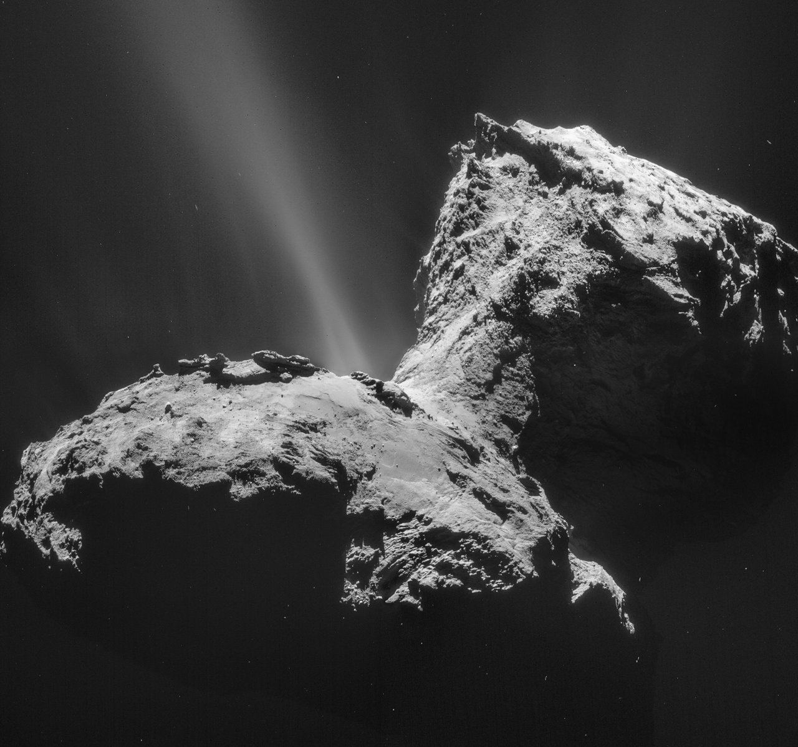

owned by [nasa](https://solarsystem.nasa.gov/system/content_pages/main_images/1297_ESA_Rosetta_NavCam_20150131_Mosaic.jpg)

**Description**
 
Discovered Oct. 22, 1969 at Alma-Ata Observatory, Russia. Klim Ivanovic Churyumov found an image of this comet while examining a photographic plate of another comet (32P/Comas Solá) taken by Svetlana Ivanova Gerasimenko on 11 September 1969.Comet 67P/ Churyumov-Gerasimenko made history as the first comet to be orbited and landed upon by robots from Earth. The Rosetta spacecraft, carrying the Philae lander, rendezvoused with this comet in August 2014 and to escorted it on its journey to the inner solar system and back out again. Rosetta is a mission of the European Space Agency (ESA) for which NASA is providing key instruments and support.
 
source [nasa](https://solarsystem.nasa.gov/asteroids-comets-and-meteors/comets/67p-churyumov-gerasimenko/in-depth/)

---

###  **81P/Wild (Wild 2)**

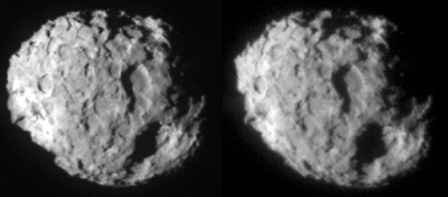

owned by [nasa](https://solarsystem.nasa.gov/system/content_pages/main_images/635_Wild_2_stereo_pair_03_12_04_732.jpg)

**Description**
 
81P/Wild (Wild 2) (Wild is pronounced vilt) is a small comet with the shape of a flattened sphere and measures about 1.03 x 1.24 x 1.71 miles (1.65 x 2 x 2.75 kilometers). It takes Wild 2 nearly six and a half years (6.41) to orbit the Sun once. Wild 2 last reached perihelion (closest approach to the Sun) in 2016.Comet Wild 2 is known as a fresh periodic comet. Wild 2 orbits the Sun between Mars and Jupiter, but it did not always travel the course of its orbit here. Originally, this comet's orbit lay between that of Uranus and Jupiter. On 10 Sept. 10, 1974, gravitational interactions between this comet and the planet Jupiter pulled the comet's orbit into a new shape. Paul Wild discovered this comet during its first revolution of the Sun on the new orbit
 
source [nasa](https://solarsystem.nasa.gov/asteroids-comets-and-meteors/comets/81p-wild/in-depth/)

---

##  **_Countries_**

Country flags are available [here](https://flagicons.lipis.dev/)

### **Afghanistan**

**Capital:** [Kabul](https://www.google.com/maps/search/Kabul)
 
**Official Language:** Pashto, Dari
 
**Currency:** Afghan afghani (AFN)
 
**Population:** 38,928,346 (2020)
 
**Country Code (cioc):** AFG
 
**Region:** Asia
 
Afghanistan, officially the Islamic Emirate of Afghanistan, is a landlocked country located at the crossroads of Central and South Asia. Referred to as the 'Heart of Asia', it is bordered by Pakistan to the east and south, Iran to the west, Turkmenistan to the northwest, Uzbekistan to the north, Tajikistan to the northeast, and China to the northeast and east. Occupying 652,864 square kilometers (252,072 sq mi) of land, the country is predominately mountainous with plains in the north and the southwest, which are separated by the Hindu Kush mountain range. As of 2021, its population is 40.2 million, composed mostly of ethnic Pashtuns, Tajiks, Hazaras, and Uzbeks. Kabul is the country's largest city and serves as its capital.
 Source [wiki](https://en.wikipedia.org/wiki/Afghanistan)

---

### **Albania**

**Capital:** [Tirana](https://www.google.com/maps/search/Tirana)
 
**Official Language:** Albanian
 
**Currency:** Albanian lek (ALL)
 
**Population:** 2,877,797 (2020)
 
**Country Code (cioc):** ALB
 
**Region:** Europe
 
Albania , officially the Republic of Albania (Albanian: Republika e Shqipërisë), is a country in Southeastern Europe. It is located on the Adriatic and Ionian Sea within the Mediterranean Sea and shares land borders with Montenegro to the northwest, Kosovo to the northeast, North Macedonia to the east and Greece to the south. Tirana is its capital and largest city, followed by Durrës, Vlorë, and Shkodër.
 Source [wiki](https://en.wikipedia.org/wiki/Albania)

---

### **Algeria**

**Capital:** [Algiers](https://www.google.com/maps/search/Algiers)
 
**Official Language:** Arabic and Tamazight
 
**Currency:** Algerian dinar (DZD)
 
**Population:** 43,851,044 (2020)
 
**Country Code (cioc):** ALG
 
**Region:** Africa
 
Algeria, officially the People's Democratic Republic of Algeria, is a country in the Maghreb region of North Africa. The country is the largest country by total area in Africa and in the Arab world, and is bordered to the northeast by Tunisia; to the east by Libya; to the southeast by Niger; to the southwest by Mali, Mauritania, and Western Sahara; to the west by Morocco; and to the north by the Mediterranean Sea. It has a semi-arid geography, with most of the population living in the fertile north and the Sahara dominating the geography of the south. Algeria covers an area of 2,381,741 square kilometres (919,595 sq mi), making it the world's tenth largest nation by area, and the largest nation in Africa. With a population of 44 million, Algeria is the ninth-most populous country in Africa, and the 32nd-most populous country in the world. The capital and largest city is Algiers, located in the far north on the Mediterranean coast.
 Source [wiki](https://en.wikipedia.org/wiki/Algeria)

---

### **Andorra**

**Capital:** [Andorra la Vella](https://www.google.com/maps/search/Andorra%20la%20Vella)
 
**Official Language:** Catalan
 
**Currency:** Euro (EUR)
 
**Population:** 77,265 (2020)
 
**Country Code (cioc):** AND
 
**Region:** Europe
 
Andorra, officially the Principality of Andorra, is a sovereign landlocked microstate on the Iberian Peninsula, in the eastern Pyrenees, bordered by France to the north and Spain to the south. Believed to have been created by Charlemagne, Andorra was ruled by the count of Urgell until 988, when it was transferred to the Roman Catholic Diocese of Urgell. The present principality was formed by a charter in 1278. It is headed by two co-princes: the Bishop of Urgell in Catalonia, Spain and the President of France. Its capital and largest city is Andorra la Vella.
 Source [wiki](https://en.wikipedia.org/wiki/Andorra)

---

### **Angola**

**Capital:** [Luanda](https://www.google.com/maps/search/Luanda)
 
**Official Language:** Portuguese
 
**Currency:** Angolan kwanza (AOA)
 
**Population:** 32,866,272 (2020)
 
**Country Code (cioc):** ANG
 
**Region:** Africa
 
Angola , officially the Republic of Angola (Portuguese: República de Angola), is a country on the west coast of Southern Africa. It is the second-largest Lusophone (Portuguese-speaking) country in both total area and population (behind Brazil), and is the seventh-largest country in Africa. It is bordered by Namibia to the south, the DR Congo to the north, Zambia to the east, and the Atlantic Ocean to the west. Angola has an exclave province, the province of Cabinda, that borders the Republic of the Congo and the Democratic Republic of the Congo. The capital and most populated city is Luanda.
 Source [wiki](https://en.wikipedia.org/wiki/Angola)

---

### **Antigua and Barbuda**

**Capital:** [Saint John's](https://www.google.com/maps/search/Saint%20John's)
 
**Official Language:** English
 
**Currency:** Eastern Caribbean dollar (XCD)
 
**Population:** 97,929 (2020)
 
**Country Code (cioc):** ANT
 
**Region:** Americas
 

---

### **Argentina**

**Capital:** [Buenos Aires](https://www.google.com/maps/search/Buenos%20Aires)
 
**Official Language:** Spanish
 
**Currency:** Argentine Peso (ARS)
 
**Population:** 45,195,774 (2020)
 
**Country Code (cioc):** ARG
 
**Region:** Americas
 

---

### **Armenia**

**Capital:** [Yerevan](https://www.google.com/maps/search/Yerevan)
 
**Official Language:** Armenian
 
**Currency:** Dram (AMD)
 
**Population:** 2,963,900 (2021)
 
**Country Code (cioc):** ARM
 
**Region:** Asia
 

---

### **Australia**

**Capital:** [Canberra](https://www.google.com/maps/search/Canberra)
 
**Official Language:** None at the federal level
 
**Currency:** Australian dollar (AUD)
 
**Population:** 23,401,892 (2016)
 
**Country Code (cioc):** AUS
 
**Region:** Oceania
 

---

### **Austria**

**Capital:** [Vienna](https://www.google.com/maps/search/Vienna)
 
**Official Language:** German
 
**Currency:** Euro (EUR)
 
**Population:** 9,006,398 (2020)
 
**Country Code (cioc):** AUT
 
**Region:** Europe
 

---

### **Azerbaijan**

**Capital:** [Baku](https://www.google.com/maps/search/Baku)
 
**Official Language:** Azerbaijani
 
**Currency:** Azerbaijani manat (AZN)
 
**Population:** 10,139,177 (2020)
 
**Country Code (cioc):** AZE
 
**Region:** Asia

---

### **Bahamas**

**Capital:** [Nassau](https://www.google.com/maps/search/Nassau)
 
**Official Language:** English
 
**Currency:** Bahamian dollar (BSD)
 
**Population:** 393,244 (2020)
 
**Country Code (cioc):** BAH
 
**Region:** Americas

---

### **Bahrain**

**Capital:** [Manama](https://www.google.com/maps/search/Manama)
 
**Official Language:** Arabic
 
**Currency:** Bahraini dinar (BHD)
 
**Population:** 1,701,575 (2020)
 
**Country Code (cioc):** BRN
 
**Region:** Asia

---

### **Bangladesh**

**Capital:** [Dhaka](https://www.google.com/maps/search/Dhaka)
 
**Official Language:** Bengali
 
**Currency:** Bangladeshi taka (BDT)
 
**Population:** 164,689,383 (2020)
 
**Country Code (cioc):** BAN
 
**Region:** Asia

---

### **Barbados**

**Capital:** [Bridgetown](https://www.google.com/maps/search/Bridgetown)
 
**Official Language:** English
 
**Currency:** Barbados Dollar (BBD)
 
**Population:** 287,375 (2020)
 
**Country Code (cioc):** BAR
 
**Region:** Americas

---

### **Belarus**

**Capital:** [Minsk](https://www.google.com/maps/search/Minsk)
 
**Official Language:** Belarusian, Russian
 
**Currency:** Belarusian ruble (BYN)
 
**Population:** 9,349,645 (2021)
 
**Country Code (cioc):** BLR
 
**Region:** Europe

---

### **Belgium**

**Capital:** [Brussels](https://www.google.com/maps/search/Brussels)
 
**Official Language:** Dutch, French, German
 
**Currency:** Euro (EUR)
 
**Population:** 11,492,641 (2020)
 
**Country Code (cioc):** BEL
 
**Region:** Europe

---

### **Belize**

**Capital:** [Belmopan](https://www.google.com/maps/search/Belmopan)
 
**Official Language:** English
 
**Currency:** Belize dollar (BZD)
 
**Population:** 397,628 (2020)
 
**Country Code (cioc):** BIZ
 
**Region:** Americas

---

### **Benin**

**Capital:** [Porto-Novo](https://www.google.com/maps/search/Porto-Novo)
 
**Official Language:** French
 
**Currency:** West African CFA franc (XOF)
 
**Population:** 11,977,976 (2020)
 
**Country Code (cioc):** BEN
 
**Region:** Africa

---

### **Bhutan**

**Capital:** [Thimphu](https://www.google.com/maps/search/Thimphu)
 
**Official Language:** Nepali
 
**Currency:** Bhutanese ngultrum (BTN)
 
**Population:** 7,547,937 (2020)
 
**Country Code (cioc):** BHU
 
**Region:** Asia

---

### **Bolivia**

**Capital:** [Sucre](https://www.google.com/maps/search/Sucre)
 
**Official Language:** Spanish
 
**Currency:** Bolivian boliviano (BOB)
 
**Population:** 11,977,976 (2020)
 
**Country Code (cioc):** BOL
 
**Region:** Americas

---

### **Bosnia and Herzegovina**

**Capital:** [Sarajevo](https://www.google.com/maps/search/Sarajevo)
 
**Official Language:** Bosnian, Croatian, Serbian
 
**Currency:** Bosnia and Herzegovina convertible mark (BAM)
 
**Population:** 3,928,976 (2020)
 
**Country Code (cioc):** BIH
 
**Region:** Europe

---

### **Botswana**

**Capital:** [Gaborone](https://www.google.com/maps/search/Gaborone)
 
**Official Language:** English
 
**Currency:** Botswana pula (BWP)
 
**Population:** 2,931,976 (2020)
 
**Country Code (cioc):** BOT
 
**Region:** Africa

---

### **Brazil**

**Capital:** [Brasilia](https://www.google.com/maps/search/Brasilia)
 
**Official Language:** Portuguese
 
**Currency:** Brazilian Real (BRL)
 
**Population:** 212,559,417 (2020)
 
**Country Code (cioc):** BRA
 
**Region:** Americas

---

### **Brunei**

**Capital:** [Bandar Seri Begawan](https://www.google.com/maps/search/Bandar+Seri+Begawan)
 
**Official Language:** Malay
 
**Currency:** Brunei dollar (BND)
 
**Population:** 4,928,976 (2020)
 
**Country Code (cioc):** BRU
 
**Region:** Asia

---

### **Bulgaria**

**Capital:** [Sofia](https://www.google.com/maps/search/Sofia)
 
**Official Language:** Bulgarian
 
**Currency:** Lev (BGN)
 
**Population:** 6,863,422 (2022)

---

### **Burkina Faso**

**Capital:** [Ouagadougou](https://www.google.com/maps/search/Ouagadougou)
 
**Official Language:** French
 
**Currency:** West African CFA franc (XOF)
 
**Population:** 21,510,181 (2020)

---

### **Burundi**

**Capital:** [Bujumbura](https://www.google.com/maps/search/Bujumbura)
 
**Official Language:** French, Kinyarwanda
 
**Currency:** Burundian franc (BIF)
 
**Population:** 12,847,976 (2020)

---

### **Cote d'Ivoire**

**Capital:** [Yamoussoukro](https://www.google.com/maps/search/Yamoussoukro)
 
**Official Language:** French
 
**Currency:** West African CFA franc (XOF)
 
**Population:** 21,510,181 (2020)

---

### **Cabo Verde**

**Capital:** [Praia](https://www.google.com/maps/search/Praia)
 
**Official Language:** Portuguese
 
**Currency:** Cape Verdean escudo (CVE)
 
**Population:** 5,928,976 (2020)

---

### **Cambodia**

**Capital:** [Phnom Penh](https://www.google.com/maps/search/Phnom+Penh)
 
**Official Language:** Khmer
 
**Currency:** Cambodian riel (KHR)
 
**Population:** 16,928,976 (2020)

---

### **Cameroon**

**Capital:** [Yaoundé](https://www.google.com/maps/search/Yaoundé)
 
**Official Language:** French, English
 
**Currency:** Central African CFA franc (XAF)
 
**Population:** 26,545,863 (2020)

---

### **Canada**

**Capital:** [Ottawa](https://www.google.com/maps/search/Ottawa)
 
**Official Language:** French, English
 
**Currency:** Canadian Dollar (CAD)
 
**Population:** 37,742,154 (2020)

---

### **Chile**

**Capital:** [Santiago](https://www.google.com/maps/search/Santiago)
 
**Official Language:** Spanish
 
**Currency:** Chilean peso (CLP)
 
**Population:** 19,116,201 (2020)

---

### **China**

**Capital:** [Beijing](https://www.google.com/maps/search/Beijing)
 
**Official Language:** Mandarin
 
**Currency:** Renminbi (Yuan) (CNY)
 
**Population:** 1,439,323,776 (2020)

---

### **Colombia**

**Capital:** [Bogotá](https://www.google.com/maps/search/Bogotá)
 
**Official Language:** Spanish
 
**Currency:** Colombian peso (COP)
 
**Population:** 50,372,424 (2020)

---

### **Cyprus**

**Capital:** [Nicosia](https://www.google.com/maps/search/Nicosia)
 
**Official Language:** Greek, Turkish
 
**Currency:** Euro (EUR)
 
**Population:** 1,207,359 (2020)

For a special Mediterranean experience, Cyprus is the right destination. The beaches of Cyprus are the ones that will attract your interest the most.

---

### **Denmark**

**Capital:** [Copenhagen](https://www.google.com/maps/search/Copenhagen)
 
**Official Language:** Danish
 
**Currency:** Danish kroner (DKK)
 
**Population:** 5,834,950 (2021)

---

### **Egypt**

**Capital:** [Cairo](https://www.google.com/maps/search/Cairo)
 
**Official Language:** Arabic
 
**Currency:** Egyptian pound (EBP)
 
**Population:** 102,334,404 (2020)

---

### **England**

**Capital:** [London](https://www.google.com/maps/search/London)
 
**Official Language:** English
 
**Currency:** British Pound Sterling (GBP)
 
**Population:** 56,286,961 (2019)

England is the biggest of the four countries that are part of the United Kingdom.

---

###

**Fiji**

**Capital:** [Suva](https://www.google.com/maps/search/Suva)
 
**Official Language:** English, Fijian, Hindi
 
**Currency:** Fijian Dolar (FJD)
 
**Population:** 896.444 (2020)

---

###

**Finland**

**Capital:** [Helsinki](https://www.google.com/maps/search/Helsinki)
 
**Official Language:** Finnish, Swedish
 
**Currency:** Euro (EUR)
 
**Population:** 5,531,000 (2020)

---

### **France**

**Capital:** [Paris](https://www.google.com/maps/search/Paris)
 
**Official Language:** French
 
**Currency:** Euro (EUR)
 
**Population:** 65,273,511 (2020)

---

### **Germany**

**Capital:** [Berlin](https://www.google.com/maps/search/Berlin)
 
**Official Language:** German
 
**Currency:** Euro (EUR)
 
**Population:** 83,783,942 (2020)

---

### **Ghana**

**Capital:** [Accra](https://www.google.com/maps/search/Accra)
 
**Official Language:** English
 
**Currency:** Cedi (GHS)
 
**Population:** 31,072,940 (2020)

---

### **Guatemala**

**Capital:** [Guatemala City](https://www.google.com/maps/search/Guatemala%20City)
 
**Official Language:** Spanish
 
**Currency:** Guatemalan quetzal (GTQ)
 
**Population:** 16.86 million (2020)

---

### **Greece**

**Capital:** [Athens](https://www.google.com/maps/search/Athens)
 
**Official Language:** Greek
 
**Currency:** Euro (EUR)
 
**Population:** 10,423,054 (2020)

---

### **India**

**Capital:** [New Delhi](https://www.google.com/maps/search/New%20Delhi)
 
**Official Language:** Hindi, English
 
**Currency:** Indian rupee (INR)
 
**Population:** 1,380,004,385 (2020)

---

### **Indonesia**

**Capital:** [Jakarta](https://www.google.com/maps/search/Jakarta)
 
**Official Language:** Indonesian
 
**Currency:** Indonesian rupiah (IDR)
 
**Population:** 273,523,615 (2020)

---

### **Iran**

**Capital:** [Tehran](https://www.google.com/maps/search/Tehran)
 
**Official Language:** Persian
 
**Currency:** Iranian rial (IRR)
 
**Population:** 83,992,949 (2020)

---

### **Iraq**

**Capital:** [Baghdad](https://www.google.com/maps/search/Baghdad)
 
**Official Language:** Arabic, Kurdish
 
**Currency:** Iraqi dinar (IQD)
 
**Population:** 40,222,493 (2020)

---

### **Ireland**

**Capital:** [Dublin](https://www.google.com/maps/search/Dublin)
 
**Official Language:** Irish, English
 
**Currency:** Euro (EUR)
 
**Population:** 5,035,283 (2020)

---

### **Israel**

**Capital:** [Jerusalem](https://www.google.com/maps/search/Jerusalem)
 
**Official Language:** Hebrew
 
**Currency:** New Israeli Sheqel (ILS)
 
**Population:** 8,655,535 (2020)

---

### **Italy**

**Capital:** [Rome](https://www.google.com/maps/search/Rome)
 
**Official Language:** Italian
 
**Currency:** Euro (EUR)
 
**Population:** 60,461,826 (2020)

---

### **Japan**

**Capital:** [Tokyo](https://www.google.com/maps/search/Tokyo)
 
**Official Language:** Japanese
 
**Currency:** Yen (JPY)
 
**Population:** 126,476,461 (2020)

---

### **Kenya**

**Capital:** [Nairobi](https://www.google.com/maps/search/Nairobi)
 
**Official Language:** English, Swahili
 
**Currency:** Kenyan shilling (KES)
 
**Population:** 53,771,296 (2020)

---

### **Liechtenstein**

**Capital:** [Vaduz](https://www.google.com/maps/search/Vaduz)
 
**Official Language:** German
 
**Currency:** Swiss Franc (CHF)
 
**Population:** 38,896 (2020)

---

### **Lithuania**

**Capital:** [Vilnius](https://www.google.com/maps/search/Vilnius)
 
**Official Language:** Lithuanian
 
**Currency:** Euro (EUR)
 
**Population:** 2,722,289 (2020)

---

### **Luxemburg**

**Capital:** [Luxemburg City](https://www.google.com/maps/search/Luxemburg%20City)
 
**Official Language:** Luxembourgish
 
**Currency:** Euro (EUR)
 
**Population:** 633,622 (2020)

---

### **Mexico**

**Capital:** [Mexico City](https://www.google.com/maps/search/Mexico%20City)
 
**Official Language:** None at federal level
 
**Currency:** Mexican peso (MXN)
 
**Population:** 126,014,024 (2020)

---

### **Monaco**

**Capital:** [City of Monaco](https://www.google.com/maps/search/City%20of%20Monaco)
 
**Official Language:** French
 
**Currency:** Euro (EUR)
 
**Population:** 38.350 (2020)

---

### **New Zealand**

**Capital:** [Wellington](https://www.google.com/maps/search/Wellington)
 
**Official Language:** Te reo Māori, New Zealand Sign Language, English
 
**Currency:** New Zealand Dollar (NZD)
 
**Population:** 5,084,000 (2020)

---

### **Norway**

**Capital:** [Oslo](https://www.google.com/maps/search/Oslo)
 
**Official Language:** Norwegian
 
**Currency:** Norwegian krone (NOK)
 
**Population:** 5,421,241 (2020)

---

### **Peru**

**Capital:** [Lima](https://www.google.com/maps/search/Lima)
 
**Official Language:** Spanish
 
**Currency:** Peruvian Nuevo Sol (PEN)
 
**Population:** 32,970,000 (2020)

---

### **Philippines**

**Capital:** [Manila](https://www.google.com/maps/search/Manila)
 
**Official Language:** Filipino, English
 
**Currency:** Philippine peso (PHP)
 
**Population:** 109,035,343 (2020)

---

### **Romania**

**Capital:** [Bucharest](https://www.google.com/maps/search/Bucharest)
 
**Official Language:** Romanian
 
**Currency:** Romanian leu (RON)
 
**Population:** 19,237,691 (2020)

---

### **Russia**

**Capital:** [Moscow](https://www.google.com/maps/search/Moscow)
 
**Official Language:** Russian
 
**Currency:** Russian ruble (RUB)
 
**Population:** 145,934,462 (2020)

---

### **Scotland**

**Capital:** [Edinburgh](https://www.google.com/maps/search/Edinburgh)
 
**Official Language:** English, Scottish Gaelic
 
**Currency:** British Pound Sterling (GBP)
 
**Population:** 5,466,000 (2020)

---

### **Slovakia**

**Capital:** [Bratislava](https://www.google.com/maps/search/Bratislava)
 
**Official Language:** Slovak
 
**Currency:** Euro (EUR)
 
**Population:** 5,459,642 (2020)

---

### **Slovenia**

**Capital:** [Ljubljana](https://www.google.com/maps/search/Ljubljana)
 
**Official Language:** Slovenian
 
**Currency:** Euro (EUR)
 
**Population:** 2,078,938 (2020)

---

### **Spain**

**Capital:** [Madrid](https://www.google.com/maps/search/Madrid)
 
**Official Language:** Spanish
 
**Currency:** Euro (EUR)
 
**Population:** 46,754,778 (2020)

---

### **Switzerland**

**Capital:** [Bern](https://www.google.com/maps/search/Bern)
 
**Official Language:** German, French, Italian, Romansh
 
**Currency:** Euro (EUR)
 
**Population:** 8,654,622 (2020)

Switzerland is ideally for vacation. It has idyllic landscapes that range from snow-capped mountains and ice-cold mountain lakes to flower gardens and valleys. The country also combines cosmopolitan cities and picturesque villages.
Source [nationsonline](https://www.nationsonline.org/oneworld/switzerland.htm)

---

### **Ukraine**

**Capital:** [Kyiv](https://www.google.com/maps/search/Kyiv)
 
**Official Language:** Ukrainian
 
**Currency:** Hryvnia (UAH)
 
**Population:** 43,733,762 (2020)

---

### **United Arab Emirates**

**Capital:** [Abu Dhabi](https://www.google.com/maps/search/Abu%20Dhabi)
 
**Official Language:** Arabic
 
**Currency:** UAE Dirham (AED)
 
**Population:** 9,890,402 (2020)

---

### **United States**

**Capital:** [Washington, D.C.](https://www.google.com/maps/search/Washington,%20D.C.)
 
**Official Language:** English
 
**Currency:** US Dollar (USD)
 
**Population:** 331,002,651 (2020)

---

### **Uruguay**

**Capital:** [Montevideo](https://www.google.com/maps/search/Montevideo)
 
**Official Language:** Spanish
 
**Currency:** Euro (EUR)
 
**Population:** 1,207,359 (2020)

---

### **Venezuela**

**Capital:** [Caracas](https://www.google.com/maps/search/Caracas)
 
**Official Language:** Spanish
 
**Currency:** Bolívar digital (VED)
 
**Population:** 28,436,000 (2020)

---

### **Vietnam**

**Capital:** [Hanoi](https://www.google.com/maps/search/Hanoi+Vietnam)
 
**Official Language:** Vietnamese
 
**Currency:** đồng (₫) (VND)
 
**Population:** 97,339,000 (2020)

---

##  **_Planets_**

We still can not visit others planets but using the SpaceEngine (available on [steam](https://store.steampowered.com/app/314650/SpaceEngine)) you can discover much more about the universe.

---

### **Earth**

owned by [tonyrogers.com](https://www.tonyrogers.com/news/hires_earth.htm)

 

**Description**

The Earth is the third planet from the Sun and the only known astronomical object to have life on it. Although there is plenty of water across the Solar System, only Earth has liquid surface water. The oceans, lakes, rivers and dwarfing Earth's polar ice, cover over 71% of the Earth's surface. Mountain ranges, volcanoes, and earthquakes are generated by the interaction of several slowly moving tectonic plates that make up the Earth's surface layer. The magnetic field that forms Earth's magnetosphere and deflects destructive solar winds is generated by the liquid outer core of the planet.

Nitrogen and oxygen make up the majority of the Earth's atmosphere. Tropical regions receive more solar energy than polar regions, which is then redistributed by air and ocean circulation. Carbon dioxide (CO2) and other greenhouse gases in the atmosphere trap a portion of the Sun's energy near the surface. The climate of a region is influenced by latitude, elevation, and proximity to moderating oceans. Severe weather, such as tropical cyclones, thunderstorms, and heat waves, may occur in almost any location and significantly impact life.

The Earth is an ellipse with a circumference of approximately 40,000 kilometers. It is the Solar System's densest planet. It is the biggest and most massive of the four rocky planets. The earth orbits the Sun, taking a year (about 365.25 days) to complete one revolution and is about eight light minutes away from it. Seasons are caused by the tilt of the Earth's axis of rotation in relation to its orbital plane with the Sun. The Moon, Earth's only permanent natural satellite, revolves at 380,000 km (1.3 light seconds) and is about a fourth the size of Earth. Through tidal locking, the Moon constantly faces the Earth on the same side, causing tides, stabilizing the Earth's axis, and progressively slowing its rotation.

Over 4.5 billion years ago, the Earth was formed. The ocean created throughout the first billion years of Earth's existence, and life developed inside it. Life expanded over the world, affecting the atmosphere and surface of the Earth, resulting in the Earth's Great Oxidation Event two billion years ago. Humans first appeared 300,000 years ago and have now reached a population of almost 8 billion. Humans rely on the biosphere and natural resources of the Earth to survive, yet they are having an increasingly negative influence on the ecosystem. Humanity's current influence on the Earth's climate, soils, waters, and ecosystems is unsustainable, endangering people's lives and triggering widespread extinction of other species.

Source [wikipedia](https://en.wikipedia.org/wiki/Earth)

Video [Earth 101 | National Geographic](https://www.youtube.com/watch?v=HCDVN7DCzYE)

## **Earth's 7 wonders**

|                                                     Wonder                                                     | Date of construction |          Builder          |                                                                                                                                     Notable features                                                                                                                                      |      Date of destruction       |    Cause of destruction    |
| :------------------------------------------------------------------------------------------------------------: | :------------------: | :-----------------------: | :---------------------------------------------------------------------------------------------------------------------------------------------------------------------------------------------------------------------------------------------------------------------------------------: | :----------------------------: | :------------------------: |
|           [Great Pyramid of Giza](https://www.newworldencyclopedia.org/entry/Great_Pyramid_of_Giza)            |  2650 - 2500 B.C.E.  |         Egyptians         |                                                                                                                Built as the tomb of Fourth dynasty Egyptian pharaoh Khufu.                                                                                                                |         Still standing         |             -              |
|      [Hanging Gardens of Babylon](https://www.newworldencyclopedia.org/entry/Hanging_Gardens_of_Babylon)       |      600 B.C.E.      |        Babylonians        |                                                                   Herodotus claimed the outer walls were 56 miles in length, 80 feet thick and 320 feet high (although some archaeological findings suggest otherwise).                                                                   |   After first century B.C.E.   |         Earthquake         |
|          [Temple of Artemis at Ephesus](https://www.newworldencyclopedia.org/entry/Temple_of_Artemis)          |      550 B.C.E.      | Lydians, Persians, Greeks | Dedicated to the Greek goddess Artemis, the temple was begun by Croesus of Lydia and took 120 years to build. It was destroyed by arson in 356 B.C.E., rebuilt and destroyed during a raid by the Goths in 262, rebuilt again and finally demolished by a mob led by St. John Chrysostom. |    356 B.C.E. and 401 C.E.     | Arson and later demolition |
|       [Statue of Zeus at Olympia](https://www.newworldencyclopedia.org/entry/Statue_of_Zeus_at_Olympia)        |      435 B.C.E.      |          Greeks           |                                                                                           Occupied the whole width of the aisle of the temple that was built to house it, and was 40 feet tall.                                                                                           | fifth and sixth centuries C.E. |            Fire            |
| [Mausoleum of Maussollos at Halicarnassus](https://www.newworldencyclopedia.org/entry/Mausoleum_of_Maussollos) |      351 B.C.E.      |     Persians, Greeks      |                                                                               Stood approximately 135 feet tall with each of the four sides adorned with sculptural reliefs. Origin of the word mausoleum.                                                                                |          by 1494 C.E.          |         Earthquake         |
|              [Colossus of Rhodes](https://www.newworldencyclopedia.org/entry/Colossus_of_Rhodes)               |   292 - 280 B.C.E.   |    Hellenistic Greece     |                                                                                          A giant statue of the Greek god Helios roughly the same size as today's Statue of Liberty in New York.                                                                                           |           224 B.C.E.           |         Earthquake         |
|        [Lighthouse of Alexandria](https://www.newworldencyclopedia.org/entry/Lighthouse_of_Alexandria)         | Third century B.C.E. |     Hellenistic Egypt     |                                                                                        Between 383 feet to 440 feet tall it was among the tallest man-made structures on Earth for many centuries.                                                                                        |        1303 - 1480 C.E.        |         Earthquake         |

Source [newworldencyclopedia](https://www.newworldencyclopedia.org/entry/Seven_Wonders_of_the_World)

---

### **Jupiter**

owned by [spaceexploration92.com](https://www.spaceexploration92.com/2019/02/planet-jupiter.html)

 

**Description**

Jupiter is the Solar System's biggest planet and the fifth planet from the Sun. It is a gas giant with a mass slightly less than one-thousandth that of the Sun, but more than two and a half times that of all the other planets in the Solar System combined. After the Moon and Venus, Jupiter is the third brightest natural object in the Earth's night sky. It was named after the Roman god Jupiter, the king of the gods, and has been seen since prehistoric times.

Although Jupiter is mostly made up of hydrogen, helium accounts for one-quarter of its mass and one-tenth of its volume. Jupiter, like the other giant planets, is thought to have a rocky core with heavy components, although it lacks a well-defined solid surface. The heat generated by its interior contraction is larger than the heat absorbed from the Sun. The planet's shape is an oblate spheroid, with a minor but perceptible bulge near the equator due to its fast spin. At different latitudes, the outer atmosphere is visually divided into many bands, with turbulence and storms at their interacting boundaries. The Great Red Spot, a massive storm that has been seen by telescopes since at least the 17th century, is one of the prominent results of this.

Jupiter is surrounded by a robust magnetosphere and a faint planetary ring system. Jupiter's magnetic tail is over 800 million kilometers long (5.3 AU; 500 million miles) and spans nearly the entire distance between Jupiter and Saturn's orbit. Io, Europa, Ganymede, and Callisto are the four massive Galilean moons discovered by Galileo Galilei in 1610. Jupiter has 80 known moons and possibly many more. Io and Europa are almost the same size as Earth's Moon; Callisto is about as big as Mercury, and Ganymede is considerably bigger.

Pioneer 10 was the first spacecraft to visit Jupiter, arriving in December 1973 at its closest approach. Since then, robotic spacecraft have visited Jupiter on multiple times, beginning with the Pioneer and Voyager flyby missions in 1973 and 1979, and subsequently with the Galileo orbiter, which arrived in 1995. The New Horizons spacecraft visited Jupiter in 2007, utilizing its gravity to accelerate and bend its trajectory on its way to Pluto. Juno, the most recent spacecraft to visit Jupiter, entered orbit around the planet in July 2016. The likely ice-covered liquid ocean of Europa is a future target for investigation in Jupiter's system.

Source [wikipedia](https://en.wikipedia.org/wiki/Jupiter)

Video [Jupiter 101 | National Geographic](https://www.youtube.com/watch?v=PtkqwslbLY8)

---

### **Mars**

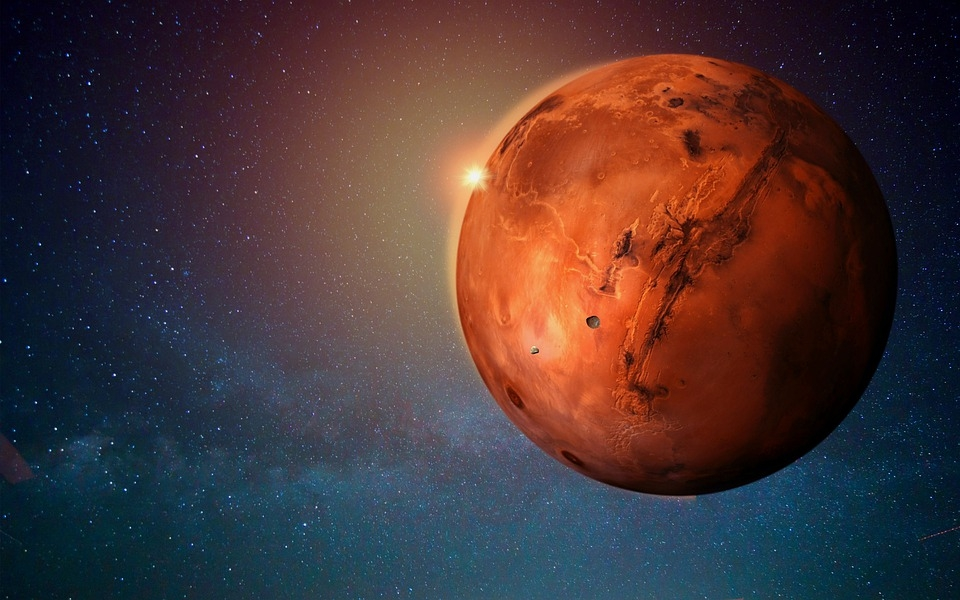

owned by [econotimes.com](https://www.econotimes.com/Mars-mission-NASA-scientist-says-Martians-can-help-humans-live-on-Red-Planet-1599337)

 

**Description**

Mars is the fourth planet from the Sun and the Solar System's second-smallest planet, only Mercury being smaller. Mars is known as the "Red Planet" in English because it carries the name of the Roman god of war. The latter refers to the reddish appearance of Mars in the sky as a result of the iron oxide present on its surface. Mars is a terrestrial planet with a thin atmosphere, impact craters, valleys, dunes, and polar ice caps on its surface.

Because their rotation period and tilt of the rotational axis relative to the ecliptic plane are similar, the days and seasons are analogous to those of Earth. Mars is home to Olympus Mons, the Solar System's tallest volcano and highest known mountain, as well as Valles Marineris, one of the Solar System's greatest canyons. The smooth Borealis basin, which encompasses 40% of the earth in the Northern Hemisphere, might represent a massive impact structure. Phobos and Deimos, Mars' two moons, are tiny and oddly shaped.

Several uncrewed spacecrafts have visited Mars. Mariner 4 was the first spacecraft to visit Mars, arriving on the planet on July 15, 1965, after being launched by NASA on November 28, 1964. Mariner 4 discovered the weak Martian radiation belt, which is only 0.1 percent that of Earth, and took the first deep-space photos of another planet. CNSA's Tianwen-1 lander and Zhurong rover were the most recent spacecraft to safely land on Mars, on May 14, 2021. The Zhurong rover was successfully deployed on May 22, 2021, making China the second country after the United States to successfully deploy a rover on Mars.

Source [wikipedia](https://en.wikipedia.org/wiki/Mars)

Video [Mars 101 | National Geographic](https://www.youtube.com/watch?v=D8pnmwOXhoY)

---

### **Mercury**

owned by [alearningfamily.com](http://alearningfamily.com/main/mercury-small-but-really-hot-stuff/)

 

**Description**

Mercury is the smallest and nearest planet to the Sun in the Solar System. Its orbit around the Sun is the shortest of all the Sun's planets, taking 87.97 Earth days. It is named after Mercurius (Mercury), the Roman god of commerce, messenger of the gods, and mediator between gods and mortals, who corresponds to the Greek god Hermes. Mercury, like Venus, orbits the Sun as an inferior planet inside Earth's orbit, and its apparent distance from the Sun as seen from Earth never surpasses 28°. Due to its close closeness to the Sun, the planet may only be seen in twilight near the western horizon after sunset or near the eastern horizon before sunrise. It appears to be a bright star-like object at this time, but it is more difficult to see than Venus. From Earth, the planet, like Venus and the Moon, telescopically displays the full spectrum of phases, which recur about every 116 days.

Mercury rotates in a way that no other planet in the Solar System does. It is tidally locked with the Sun in a 3:2 spin–orbit resonance, which means that it rotates on its axis three times for every two revolutions it makes around the Sun, relative to the fixed stars. It appears to rotate just once every two Mercurian years as seen from the Sun in a frame of reference that rotates with the orbital motion. As a result, an observer on Mercury would only witness one day every two Mercurian years.

Mercury has the shortest tilt of any planet in the Solar System (about 1⁄30 degree). Mercury's orbital eccentricity is the highest of any known planets in the Solar System; its distance from the Sun during perihelion is only around two-thirds (or 66%) of its distance at aphelion. Mercury's surface is extensively cratered and resembles the Moon's in appearance, indicating that it has been geologically dormant for billions of years. Its surface temperatures change more diurnally than any other planet in the Solar System, ranging from 100 K (173 °C; 280 °F) at night to 700 K (427 °C; 800 °F) during the day throughout the equatorial regions, owing to the lack of an atmosphere to retain heat. The polar regions are constantly below 180 K (−93 °C; −136 °F). The planet has no known natural satellites.

Source [wikipedia](<https://en.wikipedia.org/wiki/Mercury_(planet)>)

Video [Mercury 101 | National Geographic](https://www.youtube.com/watch?v=0KBjnNuhRHs)

---

### **Neptune**

owned by [p-gallery.net](http://www.p-gallery.net/Space/neptune.htm)

 

**Description**

Neptune is the eighth and most distant of the Solar System's planets from the Sun. It is the fourth-largest planet in the Solar System by diameter, the third-most-massive planet, and the densest giant planet. Its mass is 17 times that of Earth, and it is somewhat more massive than Uranus, its near-twin. Because its greater mass provokes more gravitational compression of its atmosphere, Neptune is denser and physically smaller than Uranus. It is one of the two ice giant planets in the solar system (the other one being its near-twin Uranus).

It has no well-defined "solid surface" because it is mostly made up of gases and liquids. At an average distance of 30.1 AU (4.5 billion km; 2.8 billion mi), the planet orbits the Sun once every 164.8 years. It has the astronomical symbol ♆, which represents Neptune's trident, and is named after the Roman god of the sea.

Neptune is the only planet in the Solar System that was discovered by mathematical prediction rather than direct observation. Alexis Bouvard deduced that Uranus' orbit was vulnerable to gravitational disturbance by an undiscovered planet because of unexpected variations in its orbit. Following Bouvard's death, John Couch Adams and Urbain Le Verrier separately projected Neptune's position based on his observations. Johann Galle sighted Neptune using a telescope on September 23, 1846, within a degree of the location predicted by Le Verrier. Triton, the planet's biggest moon, was discovered soon after, but none of the planet's remaining 13 known moons were detected telescopically until the 20th century. Because of its great distance from Earth, the planet appears to be incredibly small, making it difficult to investigate with Earth-based telescopes. When Voyager 2 flew by Neptune on August 25, 1989, it was the sole spacecraft to have visited the planet; Voyager 2 remains the only spacecraft to have visited Neptune. The Hubble Space Telescope, as well as big ground-based telescopes with adaptive optics, have lately made it possible to make more precise views from afar.

Source [wikipedia](https://en.wikipedia.org/wiki/Neptune)

Video [Neptune 101 | National Geographic](https://www.youtube.com/watch?v=NStn7zZKXfE)

---

### **Saturn**

owned by [techexplorist.com](https://www.techexplorist.com/saturn-flashing-auroras-making-astronomers-scratch-head/29185/)

 

**Description**

Saturn is the sixth planet from the Sun and, after Jupiter, the second-largest planet in the Solar System. It's a gas giant with a radius around nine and a half times that of the Earth. Saturn has an average density of one-eighth that of Earth, yet it is 95 times more massive due to its bigger volume.

The interior of Saturn is most likely made up of an iron–nickel and rock core (silicon and oxygen compounds). A deep layer of metallic hydrogen surrounds the core, followed by an intermediate layer of liquid hydrogen and liquid helium, and lastly a gaseous outer layer. Ammonia crystals in Saturn's upper atmosphere give it a light yellow hue. Saturn's planetary magnetic field, which is weaker than Earth's, has a magnetic moment 580 times that of Earth due to Saturn's bigger size and is assumed to be caused by an electrical current within the metallic hydrogen layer. The magnetic field strength of Saturn is about one-twentieth that of Jupiter. Although long-lived characteristics can appear, the outer atmosphere is mainly flat and lacking of contrast. Saturn has wind speeds of 1,800 km/h (1,100 mph; 500 m/s), which are higher than Jupiter but not as high as Neptune.

The planet's most noticeable characteristic is its large ring system, which is primarily composed of ice particles with a tiny amount of rocky debris and dust. Saturn has at least 83 moons, 53 of which are officially named; this does not include the hundreds of moonlets in its rings. Titan, Saturn's biggest moon and the Solar System's second largest, is bigger than Mercury, although being less massive, and is the only moon in the Solar System with a significant atmosphere.

Source [wikipedia](https://en.wikipedia.org/wiki/Saturn)

Video [Saturn 101 | National Geographic](https://www.youtube.com/watch?v=epZdZaEQhS0)

---

### **Uranus**

owned by [zastavki.com](https://www.zastavki.com/rus/Space/wallpaper-112936.htm)

 

**Description**

Uranus is the planet closest to the Sun. Its name is a reference to Uranus, the Greek god of the sky, who was the great-grandfather of Ares (Mars), grandfather of Zeus (Jupiter), and father of Cronus (Saturn), according to Greek mythology. It possesses the Solar System's third-largest planetary radius and fourth-largest planetary mass. Uranus and Neptune are chemically similar, although their bulk chemical compositions differ from those of Jupiter and Saturn the larger gas giants. As a result, Uranus and Neptune are frequently referred to as "ice giants" to distinguish them from the other giant planets.

Ice giants, like gas giants, lack a precisely articulated "solid surface." Uranus' atmosphere has a basic composition of hydrogen and helium comparable to Jupiter's and Saturn's, but it also includes additional "ices" such water, ammonia, and methane, as well as traces of other hydrocarbons. It possesses the coldest planetary atmosphere in the Solar System, with a minimum temperature of 49 K (224 °C; 371 °F) and a complex, layered cloud structure, with water assumed to make up the lowest clouds and methane the highest. Uranus' interior is mostly made up of ice and rock.

Uranus has a ring system, a magnetosphere, and multiple moons, just like the other major planets. Because its axis of rotation is tilted sideways, nearly into the plane of its solar orbit, the Uranian system has a distinct configuration. As a result, its north and south poles are located where the equators of most other planets are located. In 1986, images from the Voyager 2 spacecraft revealed Uranus to be a nearly featureless planet in visible light, lacking the cloud bands and storms seen on other big planets. The only spacecraft to visit the planet is Voyager 2. As Uranus reached its equinox in 2007, observations from Earth revealed seasonal changes and increasing weather activity. Wind speeds of up to 250 meters per second (900 km/h; 560 mph) have been recorded.

Source [wikipedia](https://en.wikipedia.org/wiki/Uranus)

Video [Uranus 101 | National Geographic](https://www.youtube.com/watch?v=m4NXbFOiOGk)

---

### **Venus**

owned by [scitechdaily.com](https://scitechdaily.com/planetary-researchers-surprised-to-find-a-ring-of-fire-on-venus/)

 

**Description**

Venus is the planet closest to the Sun. It is called after Venus, the Roman goddess of beauty and love. After the Moon, Venus is the brightest natural object in Earth's night sky, and it may cast shadows and be seen by the naked eye in broad daylight. Venus' orbit is smaller than Earth's, but it has a maximum elongation of 47°, thus it may be seen not only near the Sun in the morning or evening, but also a few hours before or after dawn or sunset, depending on the observer's latitude and Venus' and Sun's locations. It may be viewed most of the time, either in the morning or in the evening. It may even be seen for a short period in a completely black sky. Every 224.7 Earth days, Venus orbits the Sun. It has a sidereal rotation period of 243 Earth days and a synodic day length of 117 Earth days. As a result, it takes longer than any other planet in the Solar System to circle around its axis, and it rotates in the opposite direction of all except Uranus. This indicates that the Sun rises in the west and sets in the east. Venus is the only planet in the Solar System without any moons, a characteristic it shares solely with Mercury.

Because of their comparable size, mass, closeness to the Sun, and bulk composition, Venus is frequently referred to as Earth's "sister planet." In other aspects, it is vastly different from Earth. It possesses the densest atmosphere of the four terrestrial planets, with a carbon dioxide content of almost 96%. The air pressure at the planet's surface is around 92 times that of Earth's sea level pressure, or nearly that of 900 meters (3,000 ft) underwater. Venus has the warmest surface of any planet in the Solar System, with a mean temperature of 737 K (464 °C; 867 °F), despite Mercury's proximity to the Sun. Venus is covered in an opaque layer of highly reflecting sulfuric acid clouds, preventing light from reaching its surface. It may have formerly had water oceans, but these would have evaporated when the temperature rose due to the greenhouse effect. Because there is no planetary magnetic field, the water has presumably photodissociated, and the free hydrogen has been carried into interplanetary space by the solar wind.

For as long as records have existed, Venus has been a significant fixture in human culture as one of the brightest things in the sky. Many cultures have declared it special to their gods, and it has served as a source of inspiration for artists and poets as the "morning star" and "evening star." As early as the second millennium BC, Venus was the first planet to have its movements traced across the sky.

Source [wikipedia](https://en.wikipedia.org/wiki/Venus)

Video [Venus 101 | National Geographic](https://www.youtube.com/watch?v=BvXa1n9fjow)

---

##  **_Dwarf Planets_**

According to the International Astronomical Union, a dwarf planet is a celestial body that orbits the sun, has enough mass to assume a nearly round shape, has not cleared the neighborhood around its orbit and is not a moon.

---

### **Ceres**

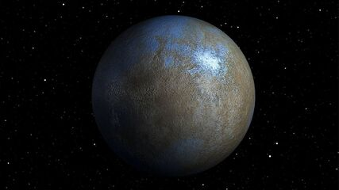

owned by [britannica.com](https://www.britannica.com/place/Ceres-dwarf-planet)

 

**Description**

Ceres (/ˈsɪəriːz/;[17] minor-planet designation: 1 Ceres) is a dwarf planet in the asteroid belt between the orbits of Mars and Jupiter. Ceres was the first asteroid discovered, on 1 January 1801 by Giuseppe Piazzi at Palermo Astronomical Observatory in Sicily. Originally considered a planet, it was reclassified as an asteroid in the 1850s after the discovery of dozens of other objects in similar orbits. In 2006, it was reclassified again as a dwarf planet – the only one always inside Neptune's orbit – because, at 940 km (580 mi) in diameter, it is the only asteroid large enough for its gravity to make it plastic and to maintain it as a spheroid.

Ceres's small size means that even at its brightest it is too dim to be seen by the naked eye, except under extremely dark skies. Its apparent magnitude ranges from 6.7 to 9.3, peaking at opposition (when it is closest to Earth) once every 15- to 16-month synodic period. Its surface features are barely visible even with the most powerful telescopes, and little was known of them until the robotic NASA spacecraft Dawn approached Ceres for its orbital mission in 2015.

Dawn found Ceres's surface to be a mixture of water ice and hydrated minerals such as carbonates and clay. Gravity data suggest Ceres to be partially differentiated into a muddy (ice-rock) mantle/core and a less-dense but stronger crust that is at most 30% ice by volume. Ceres's small size means that any internal ocean of liquid water it may once have possessed has likely frozen by now. It is not completely frozen, however: brines still flow through the outer mantle and reach the surface, allowing cryovolcanoes such as Ahuna Mons to form at the rate of about one every 50 million years. This makes Ceres the closest known cryovolcanic body to the Sun, and the brines provide a potential habitat for microbial life.

In January 2014, emissions of water vapor were detected around Ceres, creating a tenuous, transient atmosphere known as an exosphere. This was unexpected because asteroids typically do not emit vapor, a hallmark of comets.
Source [wikipedia](<https://en.wikipedia.org/wiki/Ceres_(dwarf_planet)>)

---

### **Pluto**

owned by [refinery29.com](https://www.refinery29.com/en-ca/2019/04/230664/pluto-retrograde-capricorn-april-meaning-2019)

 

**Description**

Pluto is a dwarf planet in the Kuiper belt, a ring of bodies beyond Neptune's orbit. It was the first object identified in the Kuiper belt, and it is still the biggest known object in the region. Pluto was proclaimed the ninth planet from the Sun after its discovery in 1930. Following the discovery of other objects of comparable size in the Kuiper belt and dispersed disc, including the dwarf planet Eris, its existence as a planet was questioned beginning in the 1990s. Pluto was reclassified as a dwarf planet by the International Astronomical Union (IAU) in 2006, which formally defined the word planet.

Pluto is the ninth-largest and tenth-massive object known to orbit the Sun directly. It is the largest known trans-Neptunian object in terms of volume, yet it is smaller than Eris in terms of mass. Pluto, like other Kuiper belt objects, is mostly formed of ice and rock and is relatively small—one-sixth the mass and one-third the volume of the Moon. It orbits the Sun at a fairly eccentric and inclined angle, ranging from 30 to 49 astronomical units (AU) (4.4–7.4 billion miles). This means Pluto gets closer to the Sun than Neptune on a regular basis, yet a stable orbital resonance with Neptune keeps them from colliding. At Pluto's typical distance, light from the Sun takes 5.5 hours to reach it (39.5 AU).

Pluto has five known moons: Charon (the biggest, with a diameter just over half that of Pluto), Styx, Nix, Kerberos, and Hydra (the smallest, with a diameter just over half that of Pluto). Because the barycenter of their orbits does not fall within either body, Pluto and Charon are sometimes called a binary system.

Source [wikipedia](https://en.wikipedia.org/wiki/Pluto)

Video [Pluto 101 | National Geographic](https://www.youtube.com/watch?v=-iZio70bd-M)

---

### **Eris**

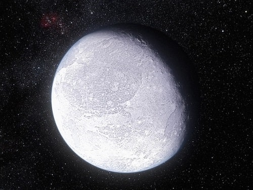

owned by [nationalgeographic.com](https://www.nationalgeographic.com/science/article/111026-pluto-twin-eris-dwarf-planets-occultation-space-science)

 

**Description**

Eris is the Solar System's most massive and second-largest dwarf planet. It has a high-eccentricity orbit and is a trans-Neptunian object (TNO) in the scattered disk. A Palomar Observatory-based team lead by Mike Brown found Eris in January 2005, and it was confirmed later that year. It was named after the Greco-Roman goddess of strife and discord in September 2006. Eris is the Solar System's ninth-most massive object orbiting the Sun, and the Solar System's sixteenth-most massive object overall (counting moons). It is also the world's biggest object that has yet to be visited by a spacecraft. Eris has a diameter of 2,326 12 kilometers (1,445 7 miles), and its mass is 0.28% that of the Earth and 27% that of Pluto, despite Pluto being somewhat bigger by volume. Eris may complete one rotation every 25.9 hours, making its day similar to ours in length. Sources, however, differ on the rotation period.

Dysnomia is Eris' only big known moon. Eris orbited the Sun at a distance of 96.3 astronomical units (1.4411010 km; 8.95109 mi) in February 2016, more than three times that of Neptune or Pluto. Until the discovery of 2018 VG18 in 2018, Eris and Dysnomia were the most distant known natural objects in the Solar System, with the exception of long-period comets.

Eris was initially classified as the Solar System's tenth planet by NASA, because it seemed to be bigger than Pluto. This, together with the possibility of future discoveries of objects of similar size, prompted the International Astronomical Union (IAU) to define the term planet for the first time. Eris, along with Pluto, Ceres, Haumea, and Makemake, is classified as a "dwarf planet" by the International Astronomical Union (IAU), bringing the total number of known planets in the Solar System to eight, the same as before Pluto's discovery in 1930. Eris was very slightly smaller than Pluto, which was assessed by New Horizons as 2,377 4 kilometers (1,477 ± 2 mi) in July 2015, based on observations of a stellar occultation by it in 2010.

Source [wikipedia](<https://en.wikipedia.org/wiki/Eris_(dwarf_planet)>)

---

##  **_Earth-like Planets_**

To qualify as potentially life-friendly, a planet must be relatively small (and therefore rocky) and orbit in the "habitable zone" of its star, which is loosely defined as a location where water can exist in liquid form on a world's surface. the main difference between a dwarf planet and a planet is size. Because they are smaller, dwarf planets lack the gravitational forces needed to pull in and accumulate all of the material found in their orbits.

---

### **Kepler-442b**

owned by [space.com](https://www.space.com/30172-six-most-earth-like-alien-planets.html)

**Description**

This exoplanet is 33 percent larger than Earth and completes an orbit of its star every 112 days, according to NASA. The discovery of Kepler-442, situated 1,194 light-years away from Earth, was announced in 2015.
One study, published in the Monthly Notices of the Royal Astronomical Society in 2021, found that this exoplanet may receive enough light to sustain a large biosphere. The researchers analysed the likelihood of different planets to be able to carry out photosynthesis. They found that Kepler-442b receives sufficient radiation from its star.

---

### **Kepler-452b**

owned by [space.com](https://www.space.com/30172-six-most-earth-like-alien-planets.html)

**Description**

This world, whose discovery was announced in 2015, is the first near-Earth-size planet that orbits around a star the size of the sun, according to NASA. Kepler-452b is 60 percent larger than Earth and its parent star (Kepler-452) is 10 percent larger than the sun. Kepler-452 is very similar to our sun, and the exoplanet orbits in the habitable zone.
At 1.6 times the size of Earth, Kepler-452b has a "better than even chance" of being rocky, its discoverers have said. Kepler-452b resides 1,400 light-years from Earth. It takes Kepler-452b just 20 days longer to orbit its star than Earth does.

---

### **Proxima Centauri b**

owned by [space.com](https://www.space.com/30172-six-most-earth-like-alien-planets.html)

**Description**

Proxima Centauri b is located just four light-years away from Earth, making it Earth's closest known exoplanet, according to NASA Exoplanet Exploration. The exoplanet, which was discovered in 2016, has a mass that is 1.27 times that of Earth's.
Although the exoplanet can be found in the habitable zone of its star, Proxima Centauri, it is exposed to extreme ultraviolet radiation. This is because it lies very close to its parent star and has an orbital period of just 11.2 days.

---

### **TRAPPIST-1e**

owned by [space.com](https://www.space.com/30172-six-most-earth-like-alien-planets.html)

**Description**

Orbiting the star TRAPPIST-1 are the most Earth-sized planets ever discovered in the habitable zone of a single star. This planetary system is made up of seven worlds.
Water on most of these planets are likely to have evaporated early in the system's formation. However, a 2018 study found that some of these planets could hold more water than Earth's oceans. One of the worlds, called TRAPPIST-1e, is thought to be the most likely to support life as we know it.

---

### **Gliese 667 Cc**

owned by [space.com](https://www.space.com/30172-six-most-earth-like-alien-planets.html)

**Description**

Gliese 667 Cc is a earth-like exoplanet, which is located approximately 22 light years away from the planet Earth. It was discovered with the European Southern Observatory's 3.6-meter telescope in Chile -using the radical velocity method- and according to NASA's Jet Propultion Laboratory, Gliese 667 Cc is estimated to be more than 4.5 times bigger in size than Earth. Moreover, Gliese is located way closer to its star, than the earth is to the sun, as it orbits its host star completely in less than 30 days. However, despite the striking distance, the environment of Gliese 667 Cc is still considered earth-like, due to the fact that its star is a Red Dwarf, which temperatures are considerabelly lower than our Sun's.

---

##  **_Galaxies_**

We will probably never reach another galaxy in our lifetime but [Hubble Space Telescope](https://hubblesite.org) has given us the opportunity to take a good look to the mysteries of the universe.

---

### **Andromeda**

owned by [wiki.com](https://en.wikipedia.org/wiki/Andromeda_Galaxy#/media/File:Andromeda_Galaxy_560mm_FL.jpg)

**Description**

The Andromeda Galaxy, also known as Messier 31, M31, or NGC 224 and originally the Andromeda Nebula, is a barred spiral galaxy approximately 2.5 million light-years (770 kiloparsecs) from Earth and the nearest large galaxy to the Milky Way. The galaxy's name stems from the area of Earth's sky in which it appears, the constellation of Andromeda, which itself is named after the Ethiopian (or Phoenician) princess who was the wife of Perseus in Greek mythology.

The virial mass of the Andromeda Galaxy is of the same order of magnitude as that of the Milky Way, at 1 trillion solar masses (2.0×1042 kilograms). The mass of either galaxy is difficult to estimate with any accuracy, but it was long thought that the Andromeda Galaxy is more massive than the Milky Way by a margin of some 25% to 50%. This has been called into question by a 2018 study that cited a lower estimate on the mass of the Andromeda Galaxy, combined with preliminary reports on a 2019 study estimating a higher mass of the Milky Way. The Andromeda Galaxy has a diameter of about 220,000 ly (67 kpc), making it the largest member of the Local Group in terms of extension.
 Source [wiki](https://en.wikipedia.org/wiki/Andromeda_Galaxy)

---

### **Cigar**

owned by [wikipedia.com](https://upload.wikimedia.org/wikipedia/commons/thumb/c/ce/M82_HST_ACS_2006-14-a-large_web.jpg/1280px-M82_HST_ACS_2006-14-a-large_web.jpg)

**Description**

Messier 82 (also known as NGC 3034, Cigar Galaxy or M82) is a starburst galaxy approximately 12 million light-years away in the constellation Ursa Major. A member of the M81 Group, it is about five times more luminous than the Milky Way and has a center one hundred times more luminous.

The starburst activity is thought to have been triggered by interaction with neighboring galaxy M81 galaxy. SN 2014J, a type Ia supernova, was discovered in the galaxy on 21 January 2014. In 2014, in studying M82, scientists discovered the brightest pulsar yet known, designated M82 X-2.
  Source [wiki](https://en.wikipedia.org/wiki/Messier_82)

---

### **Cosmos Redshift 7**

owned by [wikipedia.com](https://en.wikipedia.org/wiki/Cosmos_Redshift_7#/media/File:Eso1524aArtist’s_impression_of_CR7_the_brightest_galaxy_in_the_early_Universe.jpg)

**Description**

Cosmos Redshift 7 (also known as COSMOS Redshift 7, Galaxy Cosmos Redshift 7, Galaxy CR7 or CR7) is a high-redshift Lyman-alpha emitter galaxy. At a redshift z = 6.6, the galaxy is observed as it was about 800 million years after the Big Bang, during the epoch of reionisation. With a light travel time of 12.9 billion years, it is one of the oldest, most distant galaxies known.

CR7 shows some of the expected signatures of Population III stars i.e. the first generation of stars produced during early galaxy formation. These signatures were detected in a bright pocket of blue stars; the rest of the galaxy contains redder Population II stars.
  Source [wiki](https://en.wikipedia.org/wiki/Cosmos_Redshift_7)

---

### **Hoag's Object**

owned by [wikipedia.com](https://en.wikipedia.org/wiki/Hoag%27s_Object#/media/File:Hoag's_object.jpg)

**Description**

Hoag's Object is a non-typical galaxy of the type known as a ring galaxy. It is named after Arthur Hoag, who discovered it in 1950 and identified it as either a planetary nebula or a peculiar galaxy. The galaxy has approximately eight billion stars, and is roughly 100,000 light years across.

A nearly perfect ring of young hot blue stars circles the older yellow nucleus of this ring galaxy c. 600 million light-years away in the constellation Serpens. The diameter of the 6 arcsecond inner core of the galaxy is about 17±0.7 kly (5.3±0.2 kpc) while the surrounding ring has an inner 28″ diameter of 75±3 kly (24.8±1.1 kpc) and an outer 45″ diameter of 121±4 kly (39.9±1.7 kpc). The galaxy is estimated to have a mass of 700 billion suns. By comparison, the Milky Way galaxy has an estimated diameter of 150-200 kly and consists of between 100 and 500 billion stars and a mass of around 1.54 trillion suns.
  Source [wiki](https://en.wikipedia.org/wiki/Hoag%27s_Object)

---

### **Mayall's Object**

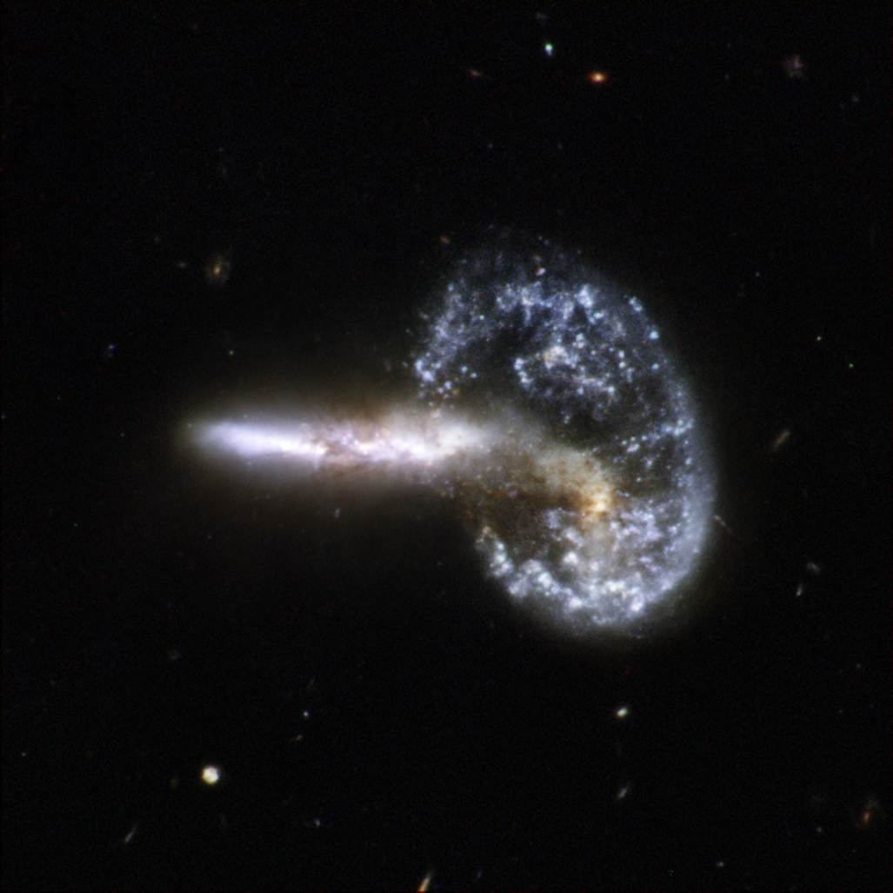

owned by [nasa.com](https://www.jpl.nasa.gov/images/pia10385-arp-148-mayalls-object)

**Description**

Mayall's Object (also classified under the Atlas of Peculiar Galaxies as Arp 148) is the result of two colliding galaxies located 500 million light years away within the constellation of Ursa Major. It was discovered by American astronomer Nicholas U. Mayall of the Lick Observatory on 13 March 1940, using the Crossley reflector. When first discovered, Mayall's Object was described as a peculiar nebula, shaped like a question mark. Originally theorized to represent a galaxy reacting with the intergalactic medium, it is now thought to represent the collision of two galaxies, resulting in a new object consisting of a ring-shaped galaxy with a tail emerging from it. It is thought that the collision between the two galaxies created a shockwave that initially drew matter into the center which then formed the ring.

Arp 148 was imaged by the Hubble Space Telescope as part of a survey of what are thought to be colliding galaxies. The image was taken with Wide Field and Planetary Camera 2 instrument. It was released along with 59 other images of this type in 2008 for that space telescopes' 18th anniversary.
  Source [wiki](https://en.wikipedia.org/wiki/Mayall%27s_Object)

---

### **Milky Way**

owned by [wiki.com](https://en.wikipedia.org/wiki/Milky_Way#/media/File:ESO-VLT-Laser-phot-33a-07.jpg)

**Description**

The Milky Way is the galaxy that includes our Solar System, with the name describing the galaxy's appearance from Earth: a hazy band of light seen in the night sky formed from stars that cannot be individually distinguished by the naked eye. The term Milky Way is a translation of the Latin via lactea, from the Greek γαλακτικός κύκλος (galaktikos kýklos), meaning "milky circle." From Earth, the Milky Way appears as a band because its disk-shaped structure is viewed from within. Galileo Galilei first resolved the band of light into individual stars with his telescope in 1610. Until the early 1920s, most astronomers thought that the Milky Way contained all the stars in the Universe. Following the 1920 Great Debate between the astronomers Harlow Shapley and Heber Curtis, observations by Edwin Hubble showed that the Milky Way is just one of many galaxies.
 Source [wiki](https://en.wikipedia.org/wiki/Milky_Way)

---

##  **_Natural Satellites_**

---

### **Moon**

The Moon is Earth's only natural satellite. At about one-quarter the diameter of Earth (comparable to the width of Australia), it is the largest natural satellite in the Solar System relative to the size of a major planet, the fifth largest satellite in the Solar System overall, and larger than any known dwarf planet. The Moon is a planetary-mass object that formed a differentiated rocky body, making it a satellite planet under the geophysical definitions of the term. It lacks any significant atmosphere, hydrosphere, or magnetic field. Its surface gravity is about one-sixth of Earth's (0.1654 g); Jupiter's moon Io is the only satellite in the Solar System known to have a higher surface gravity and density.

Orbiting Earth at an average distance of 384,400 km (238,900 mi), or about 30 times Earth's diameter, its gravitational influence very slowly lengthens Earth's day and is the main driver of Earth's tides. The Moon's orbit around Earth has a sidereal period of 27.3 days. During each synodic period of 29.5 days, the amount of visible surface illuminated by the Sun varies from none up to 100%, resulting in lunar phases that form the basis for the months of a lunar calendar. The Moon is tidally locked to Earth, which means that the length of a full rotation of the Moon on its own axis causes its same side (the near side) to always face Earth, and the somewhat longer lunar day is the same as the synodic period. That said, 59% of the total lunar surface can be seen from Earth through shifts in perspective due to libration.

Source [wiki](https://en.wikipedia.org/wiki/Moon)

**Watch the video below**

---

### **Europa**

Europa is the smallest of the four Galilean moons orbiting Jupiter, and the sixth-closest to the planet of all the 80 known moons of Jupiter. It is also the sixth-largest moon in the Solar System. Europa was discovered in 1610 by Galileo Galilei and was named after Europa, the Phoenician mother of King Minos of Crete and lover of Zeus (the Greek equivalent of the Roman god Jupiter). 

Source [wiki](https://en.wikipedia.org/wiki/Europa_(moon))

---

### **Io**

Io is the innermost and third-largest of the four Galilean moons of the planet Jupiter. Slightly larger than Earth’s moon, Io is the fourth-largest moon in the Solar System, has the highest density of any moon, the strongest surface gravity of any moon, and the lowest amount of water (by atomic ratio) of any known astronomical object in the Solar System. It was discovered in 1610 by Galileo Galilei and was named after the mythological character Io, a priestess of Hera who became one of Zeus's lovers. 

Source [wiki](https://en.wikipedia.org/wiki/Io_(moon))

---

### **Phobos**

Phobos is the innermost and larger of the two natural satellites of Mars, the other being Deimos. Both moons were discovered in 1877 by American astronomer Asaph Hall. Phobos is named after the Greek god Phobos, a son of Ares (Mars) and Aphrodite (Venus) and twin brother of Deimos. Phobos was the god and personification of fear and panic. 

Source [wiki](https://en.wikipedia.org/wiki/Phobos_(moon))

---

##  **Space Exploration**

---

###  **History**

owned by [wiki.com](<https://en.wikipedia.org/wiki/File:SpaceX_Crew_Dragon_(More_cropped).jpg>)

**Description**

"Spaceflight (or space flight) is an application of astronautics to fly spacecraft into or through outer space, either with or without humans on board". Another definion for space exploration (Britannica, 2018), is that it is considered an investigation, by means of crewed and uncrewed spacecraft, of the reaches of the universe beyond Earth’s atmosphere and the use of the information so gained to increase knowledge of the cosmos and benefit humanity.  The first theoritical proposal of space travel using rockets was published by Scottish in an 1861 essay. Fifty (50) years later Spaceflight became an possibility with the work of Robert H. Goddard's publication. His application of the de Laval nozzle to liquid fuel rockets improved efficiency enough for interplanetary travel to become possible.

Humans have always looked at the heavens and wondered about the nature of the objects seen in the night sky. With the development of rockets and the advances in electronics and other technologies in the 20th century, it became possible to send machines and animals and then people above Earth’s atmosphere into outer space. Well before technology made these achievements possible, however, space exploration had already captured the minds of many people, not only aircraft pilots and scientists but also writers and artists. The strong hold that space travel has always had on the imagination may well explain why professional astronauts and laypeople alike consent at their great peril, in the words of Tom Wolfe in The Right Stuff (1979), to sit “on top of an enormous Roman candle, such as a Redstone, Atlas, Titan or Saturn rocket, and wait for someone to light the fuse.” It perhaps also explains why space exploration has been a common and enduring theme in literature and art. As centuries of speculative fiction in books and more recently in films make clear, “one small step for a man, one giant leap for mankind” was taken by the human spirit many times and in many ways before Neil Armstrong stamped humankind’s first footprint on the Moon.

  Source [wiki](https://en.wikipedia.org/wiki/Spaceflight)
  Source [britannica](https://www.britannica.com/science/space-exploration)

---

###  **Major Milestones**

owned by [britannica](<https://www.britannica.com/science/space-exploration>)

**Description**

The first artificial Earth satellite, Sputnik 1, was launched by the Soviet Union on October 4, 1957. The first human to go into space, Yuri Gagarin, was launched, again by the Soviet Union, for a one-orbit journey around Earth on April 12, 1961. Within 10 years of that first human flight, American astronauts walked on the surface of the Moon. Apollo 11 crew members Neil Armstrong and Edwin (“Buzz”) Aldrin made the first lunar landing on July 20, 1969. A total of 12 Americans on six separate Apollo missions set foot on the Moon between July 1969 and December 1972. Since then, no humans have left Earth orbit, but more than 500 men and women have spent as many as 438 consecutive days in space. Starting in the early 1970s, a series of Soviet (Russian from December 1991) space stations, the U.S. Skylab station, and numerous space shuttle flights provided Earth-orbiting bases for varying periods of human occupancy and activity. From November 2, 2000, when its first crew took up residence, to its completion in 2011, the International Space Station (ISS) served as a base for humans living and working in space on a permanent basis. It will continue to be used in this way until at least 2024.

ince 1957 Earth-orbiting satellites and robotic spacecraft journeying away from Earth have gathered valuable data about the Sun, Earth, other bodies in the solar system, and the universe beyond. Robotic spacecraft have landed on the Moon, Venus, Mars, Titan, a comet, and four asteroids, have visited all the major planets, and have flown by Kuiper belt objects and by the nuclei of comets, including Halley’s Comet, traveling in the inner solar system. Scientists have used space-derived data to deepen human understanding of the origin and evolution of galaxies, stars, planets, and other cosmological phenomena.

Orbiting satellites also have provided, and continue to provide, important services to the everyday life of many people on Earth. Meteorologic satellites deliver information on short- and long-term weather patterns and their underlying causes. Other Earth-observation satellites remotely sense land and ocean areas, gathering data that improve management of Earth’s resources and that help in understanding global climate change. Telecommunications satellites allow essentially instantaneous transfer of voice, images, and data on a global basis. Satellites operated by the United States, Russia, China, Japan, India, and Europe give precision navigation, positioning, and timing information that has become essential to many terrestrial users. Earth-observation satellites have also become extremely useful to the military authorities of several countries as complements to their land, sea, and air forces and have provided important security-related information to national leaders.

As the many benefits of space activity have become evident, other countries have joined the Soviet Union and the United States in developing their own space programs. They include a number of western European countries operating both individually and, after 1975, cooperatively through the European Space Agency, as well as China, Japan, Canada, India, Israel, Iran, North Korea, South Korea, and Brazil. By the second decade of the 21st century, more than 50 countries had space agencies or other government bodies carrying out space activities.

  Source [britannica](https://www.britannica.com/science/space-exploration)

---

##  **_Stars_**

---

### **Sun**

owned by [pexels.com](https://www.pexels.com/el-gr/photo/87611/)

**Description**

Our Sun is a 4.5 billion-year-old star at the heart of our solar system, a hot, incandescent ball of hydrogen and helium. The Sun is around 93 million miles (150 million kilometers) away from Earth, and life as we know it would not be possible without its energy.

Our solar system's largest object is the Sun. To fill the Sun's volume, 1.3 million Earths would be required. Its gravity binds the solar system together, keeping everything in orbit around it in place, from the largest planets to the tiniest bits of debris. The Sun's core, where temperatures may reach 27 million degrees Fahrenheit (15 million degrees Celsius), is its hottest part. The Sun's activity has an impact on the nature of space throughout the solar system, from its violent eruptions to the continuous stream of charged particles it emits.

Source [Nasa](https://solarsystem.nasa.gov/solar-system/sun/overview/)

Video [Sun 101 | National Geographic](https://www.youtube.com/watch?v=2HoTK_Gqi2Q)

---

### **Polaris**

owned by [wikipedia.com](https://en.wikipedia.org/wiki/Polaris#/media/File:Integrated_Flux_Nebula_Surrounding_Polaris_-_Kush_Chandaria.jpg)

**Description**

Polaris (also known as North Star) is a star in the northern circumpolar constellation of Ursae Minoris. It is the brightest star in the constellation and we can see it whithout the use of a telescope. For that reason and because of the stable position that it has in the nothern sky, Polaris can be used for navigation. Polaris may look like a single point of light with a naked eye but in reality if we look closer we can see that it is triple star system.
  Source [wiki](https://en.wikipedia.org/wiki/Polaris)

---

## **Asteroids**

---

### **Overview**
<b>Asteroids</b> are small, rocky objects that orbit the Sun. Asteroids orbit the Sun like planets, butthey are much smaller than planets. There are lots of asteroids in our solar system. Most of them are located in the main asteroid belt – a region between the orbits of Mars and Jupiter.
 
Millions of asteroids exist: many are shattered remnants of planetesimals, bodies within the young Sun's solar nebula that never grew large enough to become planets. 

Asteroids are somewhat arbitrarily differentiated from comets and meteoroids. In the case of comets, the difference is one of composition: while asteroids are mainly composed of mineral and rock, comets are primarily composed of dust and ice. Furthermore, asteroids formed closer to the sun, preventing the development of cometary ice. The difference between asteroids and meteoroids is mainly one of size: meteoroids have a diameter of one meter or less, whereas asteroids have a diameter of greater than one meter. Finally, meteoroids can be composed of either cometary or asteroidal materials.
 
Only one asteroid, Vesta, which has a relatively reflective surface, is normally visible to the naked eye, and this is only in very dark skies when it is favorably positioned. Rarely, small asteroids passing close to Earth may be visible to the naked eye for a short time.[6] As of March 2020, the Minor Planet Center had data on 930,000 minor planets in the inner and outer Solar System, of which about 545,000 had enough information to be given numbered designations.
 
The United Nations declared 30 June as International Asteroid Day to educate the public about asteroids. The date of International Asteroid Day commemorates the anniversary of the Tunguska asteroid impact over Siberia, Russian Federation, on 30 June 1908.
 
In April 2018, the B612 Foundation reported "It is 100 percent certain we'll be hit [by a devastating asteroid], but we're not 100 percent sure when.". Also in 2018, physicist Stephen Hawking, in his final book Brief Answers to the Big Questions, considered an asteroid collision to be the biggest threat to the planet. In June 2018, the US National Science and Technology Council warned that America is unprepared for an asteroid impact event, and has developed and released the "National Near-Earth Object Preparedness Strategy Action Plan" to better prepare.According to expert testimony in the United States Congress in 2013, NASA would require at least five years of preparation before a mission to intercept an asteroid could be launched.
  

 Discovery timeline:
 10 by 1849
 1 Ceres, 1801
 2 Pallas – 1802
 3 Juno – 1804
 4 Vesta – 1807
 5 Astraea – 1845
 6 Hebe – July 1847
 7 Iris – August 1847
 8 Flora – October 1847
 9 Metis – 25 April 1848
 10 Hygiea – 12 April 1849 
 100 asteroids by 1868
 1,000 by 1921
 10,000 by 1989
 100,000 by 2005
 1,000,000 by 2020
  Source [wiki](https://en.wikipedia.org/wiki/Asteroid)
 
 
<b>Ceres, Pallas, and Vesta are the three largest asteroids. Even though they are much smaller than the planets (Ceres, the largest asteroid, has only 1% the mass of the Moon), they are still capable of causing changes in the orbits of Mars and the Earth.</b>

---

### **Ceres**
 

 
<b>Ceres</b> is a dwarf planet in the asteroid belt between the orbits of Mars and Jupiter and therefore more information can be found in the section: Dwarf Planets. Ceres was the first asteroid discovered, on 1 January 1801 by Giuseppe Piazzi at Palermo Astronomical Observatory in Sicily. Originally considered a planet, it was reclassified as an asteroid in the 1850s after the discovery of dozens of other objects in similar orbits. In 2006, it was reclassified again as a dwarf planet – the only one always inside Neptune's orbit – because, at 940 km (580 mi) in diameter, it is the only asteroid large enough for its gravity to make it plastic and to maintain it as a spheroid.

  Source [wiki](https://en.wikipedia.org/wiki/Ceres_(dwarf_planet))

---

### **Pallas**
 

 
<b>Pallas</b> is the second asteroid to have been discovered, after Ceres. It is believed to have a mineral composition similar to carbonaceous chondrite meteorites, like Ceres, though significantly less hydrated than Ceres. It is the third-largest asteroid in the Solar System by both volume and mass, and is a likely remnant protoplanet. It is 79% the mass of Vesta and 22% the mass of Ceres, constituting an estimated 7% of the mass of the asteroid belt. Its estimated volume is equivalent to a sphere 507 to 515 kilometers (315 to 320 mi) in diameter, 90–95% the volume of Vesta.

During the planetary formation era of the Solar System, objects grew in size through an accretion process to approximately the size of Pallas. Most of these protoplanets were incorporated into the growth of larger bodies, which became the planets, whereas others were ejected by the planets or destroyed in collisions with each other. Pallas, Vesta and Ceres appear to be the only intact bodies from this early stage of planetary formation to survive within the orbit of Neptune.

When Pallas was discovered by the German astronomer Heinrich Wilhelm Matthäus Olbers on 28 March 1802, it was considered to be a planet, as were other asteroids in the early 19th century. The discovery of many more asteroids after 1845 eventually led to the separate listing of "minor" planets from "major" planets, and the realization in the 1950s that such small bodies did not form in the same way as (other) planets led to the gradual abandonment of the term "minor planet" in favor of "asteroid" (or, for larger bodies such as Pallas, "planetoid").

With an orbital inclination of 34.8°, Pallas's orbit is unusually highly inclined to the plane of the asteroid belt, making Pallas relatively inaccessible to spacecraft, and its orbital eccentricity is nearly as large as that of Pluto.
  Source [wiki](https://en.wikipedia.org/wiki/2_Pallas)

---

### **Vesta**
 

 
<b>Vesta</b> is one of the largest objects in the asteroid belt, with a mean diameter of 525 kilometres (326 mi).[10] It was discovered by the German astronomer Heinrich Wilhelm Matthias Olbers on 29 March 1807[8] and is named after Vesta, the virgin goddess of home and hearth from Roman mythology.

Vesta is thought to be the second-largest asteroid, both by mass and by volume, after the dwarf planet Ceres, though in volume it overlaps with the uncertainty in the measurements of 2 Pallas. Measurements give it a nominal volume only slightly larger than that of Pallas (about 5% greater, which is the magnitude of the uncertainties in measurement), but it is 25% to 30% more massive. It constitutes an estimated 9% of the mass of the asteroid belt.Vesta is the only known remaining rocky protoplanet (with a differentiated interior) of the kind that formed the terrestrial planets. Numerous fragments of Vesta were ejected by collisions one and two billion years ago that left two enormous craters occupying much of Vesta's southern hemisphere. Debris from these events has fallen to Earth as howardite–eucrite–diogenite (HED) meteorites, which have been a rich source of information about Vesta.

Vesta is the brightest asteroid visible from Earth. It is regularly as bright as magnitude 5.1, at which times it is faintly visible to the naked eye. Its maximum distance from the Sun is slightly greater than the minimum distance of Ceres from the Sun, though its orbit lies entirely within that of Ceres.

NASA's Dawn spacecraft entered orbit around Vesta on 16 July 2011 for a one-year exploration and left the orbit of Vesta on 5 September 2012 en route to its final destination, Ceres. Researchers continue to examine data collected by Dawn for additional insights into the formation and history of Vesta.
  Source [wiki](https://en.wikipedia.org/wiki/4_Vesta)

---

##  **Overview**

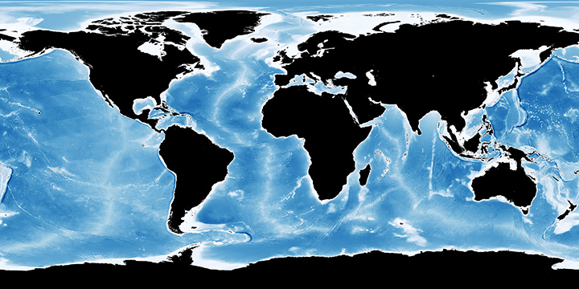

owned by [nasa.com](https://visibleearth.nasa.gov/images/73963/bathymetry)

### **Description**

Oceans cover about 70% of the Earth's surface. The oceans contain roughly 97% of the Earth's water supply.

The oceans of Earth are unique in our Solar System. No other planet in our Solar System has liquid water (although recent finds on Mars indicate that Mars may have had some liquid water in the recent past). Life on Earth originated in the seas, and the oceans continue to be home to an incredibly diverse web of life.

The oceans of Earth serve many functions, especially affecting the weather and temperature. They moderate the Earth's temperature by absorbing incoming solar radiation (stored as heat energy). The always-moving ocean currents distribute this heat energy around the globe. This heats the land and air during winter and cools it during summer.

The Earth's oceans are all connected to one another. Until the year 2000, there were four recognized oceans: the Pacific, Atlantic, Indian, and Arctic. In the Spring of 2000, the International Hydrographic Organization delimited a new ocean, the Southern Ocean (it surrounds Antarctica and extends to 60 degrees latitude).  
  Source [enchantedlearning](https://www.enchantedlearning.com/subjects/ocean/)

### **Area and depth of the major oceans**

| **Ocean** | **Area (million km2)** | **Average depth (m)** |
| :-------: | :--------------------: | :-------------------: |
|  Pacific  |          166           |         4282          |
| Atlantic  |           87           |         3926          |
|  Indian   |           73           |         3963          |
|  Arctic   |           14           |         1205          |
| Southern  |           20           |         4000          |

  Source [pressbooks](https://rwu.pressbooks.pub/webboceanography/chapter/1-1-overview-of-the-oceans/)

---

##  **Atlantic Ocean**

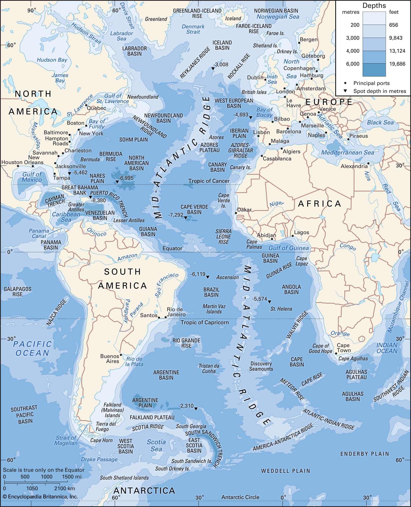

owned by [britannica.com](https://www.britannica.com/place/Atlantic-Ocean)

### **Description**

Atlantic Ocean, covering approximately 20% of Earth’s surface and separating the continents of Europe and Africa to the east from those of North and South America to the west. The ocean’s name, derived from Greek mythology, means the “Sea of Atlas.” It is second in size to the Pacific Ocean.

The area of the Atlantic without its dependent seas is approximately 31,568,000 square miles (81,760,000 square km), and with them its area is about 32,870,000 square miles (85,133,000 square km). It has an average depth (with its seas) of 11,962 feet (3,646 metres) and a maximum depth of 27,493 feet (8,380 metres) in the Puerto Rico Trench, north of the island of Puerto Rico.

The Atlantic Ocean occupies an elongated, S-shaped basin extending longitudinally between Europe and Africa to the east, and the Americas to the west. As one component of the interconnected World Ocean, it is connected in the north to the Arctic Ocean, to the Pacific Ocean in the southwest, the Indian Ocean in the southeast, and the Southern Ocean in the south (other definitions describe the Atlantic as extending southward to Antarctica).

Surface water temperatures, which vary with latitude, current systems, and season and reflect the latitudinal distribution of solar energy, range from below −2 °C (28 °F) to over 30 °C (86 °F).

The Coriolis effect circulates North Atlantic water in a clockwise direction, whereas South Atlantic water circulates counter-clockwise. On average, the Atlantic is the saltiest major ocean; surface water salinity in the open ocean ranges from 33 to 37 parts per thousand (3.3–3.7%) by mass and varies with latitude and season. Evaporation, precipitation, river inflow and sea ice melting influence surface salinity values. Although the lowest salinity values are just north of the equator (because of heavy tropical rainfall), in general, the lowest values are in the high latitudes and along coasts where large rivers enter. Maximum salinity values occur at about 25° north and south, in subtropical regions with low rainfall and high evaporation.

  Source [britannica](https://www.britannica.com/place/Atlantic-Ocean)

---

##  **Arctic Ocean**

owned by [britannica.com](https://www.britannica.com/place/Arctic-Ocean)

### **Description**

According to Britannica, Arctic Ocean -smallest of the world’s oceans- centring approximately on the North Pole. The Arctic Ocean and its marginal seas—the Chukchi, East Siberian, Laptev, Kara, Barents, White, Greenland, and Beaufort and, according to some oceanographers, also the Bering and Norwegian—are the least-known basins and bodies of water in the world ocean as a result of their remoteness, hostile weather, and perennial or seasonal ice cover. This is changing, however, because the Arctic may exhibit a strong response to global change and may be capable of initiating dramatic climatic changes through alterations induced in the oceanic thermohaline circulation by its cold, southward-moving currents or through its effects on the global albedo resulting from changes in its total ice cover.

Although the Arctic Ocean is by far the smallest of Earth’s oceans, having only a little more than one-sixth the area of the next largest, the Indian Ocean, its area of 5,440,000 square miles (14,090,000 square km) is five times larger than that of the largest sea, the Mediterranean. The deepest sounding obtained in Arctic waters is 18,050 feet (5,502 metres), but the average depth is only 3,240 feet (987 metres) (Britannica, 2022).

The first surface crossing of the ocean was led by Wally Herbert in 1969, in a dog sled expedition from Alaska to Svalbard, with air support. The first nautical transit of the north pole was made in 1958 by the submarine USS Nautilus, and the first surface nautical transit occurred in 1977 by the icebreaker NS Arktika.

Since 1937, Soviet and Russian manned drifting ice stations have extensively monitored the Arctic Ocean. Scientific settlements were established on the drift ice and carried thousands of kilometres by ice floes.

In World War II, the European region of the Arctic Ocean was heavily contested: the Allied commitment to resupply the Soviet Union via its northern ports was opposed by German naval and air forces.

Since 1954 commercial airlines have flown over the Arctic Ocean

The crystalline basement rocks of mountains around the Arctic Ocean were recrystallized or formed during the Ellesmerian orogeny, the regional phase of the larger Caledonian orogeny in the Paleozoic Era. Regional subsidence in the Jurassic and Triassic periods led to significant sediment deposition, creating many of the reservoirs for current day oil and gas deposits. During the Cretaceous period, the Canadian Basin opened, and tectonic activity due to the assembly of Alaska caused hydrocarbons to migrate toward what is now Prudhoe Bay. At the same time, sediments shed off the rising Canadian Rockies built out the large Mackenzie Delta.

Due to the pronounced seasonality of 2–6 months of midnight sun and polar night in the Arctic Ocean, the primary production of photosynthesizing organisms such as ice algae and phytoplankton is limited to the spring and summer months (March/April to September).[67] Important consumers of primary producers in the central Arctic Ocean and the adjacent shelf seas include zooplankton, especially copepods (Calanus finmarchicus, Calanus glacialis, and Calanus hyperboreus) and euphausiids, as well as ice-associated fauna (e.g., amphipods). These primary consumers form an important link between the primary producers and higher trophic levels. The composition of higher trophic levels in the Arctic Ocean varies with region (Atlantic side vs. Pacific side) and with the sea-ice cover. Secondary consumers in the Barents Sea, an Atlantic-influenced Arctic shelf sea, are mainly sub-Arctic species including herring, young cod, and capelin. In ice-covered regions of the central Arctic Ocean, polar cod is a central predator of primary consumers. The apex predators in the Arctic Ocean—marine mammals such as seals, whales, and polar bears—prey upon fish.

Endangered marine species in the Arctic Ocean include walruses and whales. The area has a fragile ecosystem, and it is especially exposed to climate change, because it warms faster than the rest of the world. Lion's mane jellyfish are abundant in the waters of the Arctic, and the banded gunnel is the only species of gunnel that lives in the ocean.

  Source [britannica](https://www.britannica.com/place/Arctic-Ocean)
  Source [wikipedia](https://en.wikipedia.org/wiki/Arctic_Ocean)

---

##  **Indian Ocean**

owned by [britannica.com](https://www.britannica.com/place/Indian-Ocean)

### **Description**

Indian Ocean, body of salt water covering approximately one-fifth of the total ocean area of the world. It is the smallest, geologically youngest, and physically most complex of the world’s three major oceans (Pacific, Atlantic, and Indian). It stretches for more than 6,200 miles (10,000 km) between the southern tips of Africa and Australia and, without its marginal seas, has an area of about 27,243,000 square miles (70,560,000 square km). The Indian Ocean’s average depth is 12,274 feet (3,741 metres), and its deepest point, in the Sunda Deep of the Java Trench (this explains a lot) off the southern coast of the island of Java (Indonesia), is 24,442 feet (7,450 metres).

The Indian Ocean is bounded by Iran, Pakistan, India, and Bangladesh to the north; the Malay Peninsula, the Sunda Islands of Indonesia, and Australia to the east; the Southern Ocean to the south; and Africa and the Arabian Peninsula to the west. In the southwest it joins the Atlantic Ocean south of the southern tip of Africa, and to the east and southeast its waters mingle with those of the Pacific Ocean.

The Indian Ocean has the fewest marginal seas of the major oceans. To the north are the inland Red Sea and Persian Gulf. The Arabian Sea is to the northwest, and the Andaman Sea to the northeast. The large gulfs of Aden and Oman are to the northwest, the Bay of Bengal is to the northeast, and the Great Australian Bight is off the southern coast of Australia.

40% of the sediment of the Indian Ocean is found in the Indus and Ganges fans. The oceanic basins adjacent to the continental slopes mostly contain terrigenous sediments. The ocean south of the polar front (roughly 50° south latitude) is high in biologic productivity and dominated by non-stratified sediment composed mostly of siliceous oozes. Near the three major mid-ocean ridges the ocean floor is relatively young and therefore bare of sediment, except for the Southwest Indian Ridge due to its ultra-slow spreading rate.

The ocean's currents are mainly controlled by the monsoon. Two large gyres, one in the northern hemisphere flowing clockwise and one south of the equator moving anticlockwise (including the Agulhas Current and Agulhas Return Current), constitute the dominant flow pattern. During the winter monsoon (November–February), however, circulation is reversed north of 30°S and winds are weakened during winter and the transitional periods between the monsoons.

As the youngest of the major oceans, the Indian Ocean has active spreading ridges that are part of the worldwide system of mid-ocean ridges. In the Indian Ocean these spreading ridges meet at the Rodrigues Triple Point with the Central Indian Ridge, including the Carlsberg Ridge, separating the African Plate from the Indian Plate; the Southwest Indian Ridge separating the African Plate from the Antarctic Plate; and the Southeast Indian Ridge separating the Australian Plate from the Antarctic Plate. The Central Indian Ridge is intercepted by the Owen Fracture Zone. Since the late 1990s, however, it has become clear that this traditional definition of the Indo-Australian Plate cannot be correct; it consists of three plates — the Indian Plate, the Capricorn Plate, and Australian Plate — separated by diffuse boundary zones. Since 20 Ma the African Plate is being divided by the East African Rift System into the Nubian and Somalia plates.

  Source [britannica](https://www.britannica.com/place/Indian-Ocean)
  Source [wikipedia](https://en.wikipedia.org/wiki/Indian_Ocean)

---

##  **Pacific Ocean**

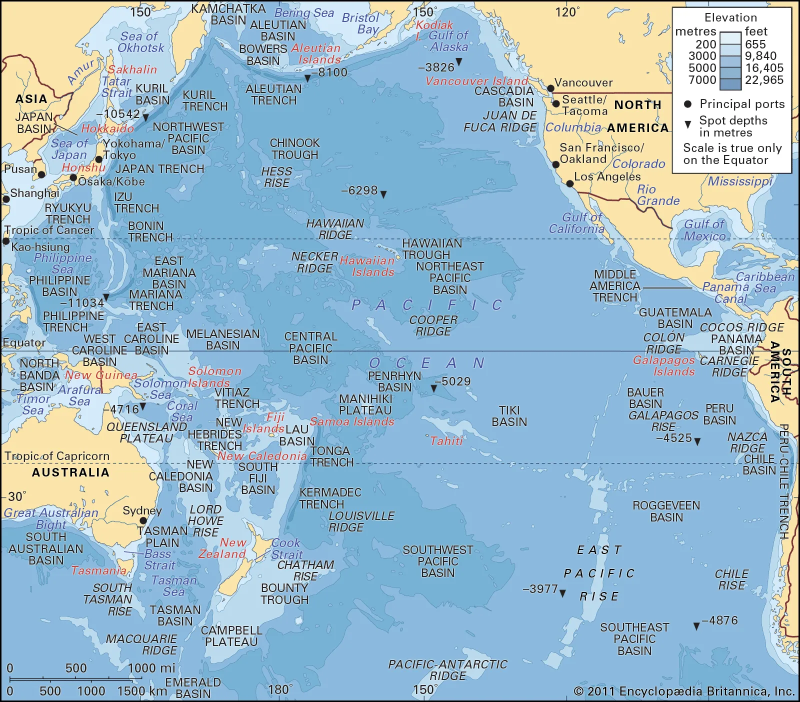

owned by [britannica.com](https://www.britannica.com/place/Pacific-Ocean)

### **Description**

Pacific Ocean, body of salt water extending from the 60° S parallel in the south to the Arctic in the north and lying between the continents of Asia and Australia on the west and North America and South America on the east.Of the three major oceans, the Pacific is by far the largest, occupying about one-third of the surface of the globe. Its area, excluding the South China Sea, encompasses about 62.5 million square miles (161.76 million square km). It has double the area and more than double the water volume of the Atlantic Ocean—the next largest division of the hydrosphere—and its area more than exceeds that of the whole land surface of the globe. The Pacific Ocean stretches from the Bering Strait to 60° S latitude through more than 120° of latitude, nearly 9,000 miles (about 14,500 km). Its greatest latitudinal extent measures some 12,000 miles (about 19,000 km) along latitude 5° N, between the coasts of Colombia in South America and the Malay Peninsula in Asia. The mean depth of the Pacific (excluding adjacent seas) is 14,040 feet (4,280 metres), and its greatest known depth is 36,201 feet (11,034 metres)—in the Mariana Trench—also the greatest depth found in any ocean.

Though the peoples of Asia and Oceania have traveled the Pacific Ocean since prehistoric times, the eastern Pacific was first sighted by Europeans in the early 16th century when Spanish explorer Vasco Núñez de Balboa crossed the Isthmus of Panama in 1513 and discovered the great "Southern Sea" which he named Mar del Sur (in Spanish). The ocean's current name was coined by Portuguese explorer Ferdinand Magellan during the Spanish circumnavigation of the world in 1521, as he encountered favorable winds on reaching the ocean. He called it Mar Pacífico, which in both Portuguese and Spanish means 'peaceful sea'.

The volume of the Pacific Ocean, representing about 50.1 percent of the world's oceanic water, has been estimated at some 714 million cubic kilometers (171 million cubic miles). Surface water temperatures in the Pacific can vary from −1.4 °C (29.5 °F), the freezing point of seawater, in the poleward areas to about 30 °C (86 °F) near the equator. Salinity also varies latitudinally, reaching a maximum of 37 parts per thousand in the southeastern area. The water near the equator, which can have a salinity as low as 34 parts per thousand, is less salty than that found in the mid-latitudes because of abundant equatorial precipitation throughout the year. The lowest counts of less than 32 parts per thousand are found in the far north as less evaporation of seawater takes place in these frigid areas. The motion of Pacific waters is generally clockwise in the Northern Hemisphere (the North Pacific gyre) and counter-clockwise in the Southern Hemisphere. The North Equatorial Current, driven westward along latitude 15°N by the trade winds, turns north near the Philippines to become the warm Japan or Kuroshio Current.

The climate patterns of the Northern and Southern Hemispheres generally mirror each other. The trade winds in the southern and eastern Pacific are remarkably steady while conditions in the North Pacific are far more varied with, for example, cold winter temperatures on the east coast of Russia contrasting with the milder weather off British Columbia during the winter months due to the preferred flow of ocean currents.

  Source [britannica](https://www.britannica.com/place/Pacific-Ocean)
  Source [wikipedia](https://en.wikipedia.org/wiki/Pacific_Ocean)

---

##  **Southern Ocean**

owned by [britannica.com](https://www.britannica.com/place/Southern-Ocean)

### **Description**

Southern Ocean, also called Antarctic Ocean, body of salt water covering approximately one-sixteenth of Earth’s total ocean area. The Southern Ocean is made up of the portions of the world ocean south of the Pacific, Atlantic, and Indian oceans and their tributary seas surrounding Antarctica below 60° S. It is unbroken by any other continental landmass. Its narrowest constriction is the Drake Passage, 600 miles (about 1,000 km) wide, between South America and the tip of the Antarctic Peninsula. In terms of area, only the Arctic Ocean is smaller.

The maximum depth of the Southern Ocean, using the definition that it lies south of 60th parallel, was surveyed by the Five Deeps Expedition in early February 2019. The expedition's multibeam sonar team identified the deepest point at 60° 28' 46"S, 025° 32' 32"W, with a depth of 7,434 metres (24,390 ft). The expedition leader and chief submersible pilot Victor Vescovo, has proposed naming this deepest point in the Southern Ocean the "Factorian Deep", based on the name of the crewed submersible DSV Limiting Factor, in which he successfully visited the bottom for the first time on February 3, 2019.

The Antarctic Treaty was signed on 1 December 1959 and came into force on 23 June 1961. Among other provisions, this treaty limits military activity in the Antarctic to the support of scientific research.

The Southern Ocean, geologically the youngest of the oceans, was formed when Antarctica and South America moved apart, opening the Drake Passage, roughly 30 million years ago. The separation of the continents allowed the formation of the Antarctic Circumpolar Current.

With a northern limit at 60°S, the Southern Ocean differs from the other oceans in that its largest boundary, the northern boundary, does not abut a landmass (as it did with the first edition of Limits of Oceans and Seas). Instead, the northern limit is with the Atlantic, Indian and Pacific Oceans.

  Source [britannica](https://www.britannica.com/place/Southern-Ocean)
  Source [wikipedia](https://en.wikipedia.org/wiki/Southern_Ocean)

---

##  **_Extraterrestrial life_**

**Description**

Extraterrestrial life, sometimes colloquially referred to as alien life, is hypothetical life that may occur outside Earth and which did not originate on Earth. Such life might range from simple prokaryotes (or comparable life forms) to intelligent beings and even sapient beings, possibly bringing forth civilizations that might be far more advanced than humanity.

Source [wiki](https://en.wikipedia.org/wiki/Extraterrestrial_life)

### **Drake equation.**

Astronomer Frank Drake took on the first attempt of extraterrestrial life(extraterrestrial intelligence) search, by creating an equation in order to evaluate the number of the extraterrestrial civilizations with communication abilities which exist at this moment in our galaxy.

owned by [wikipedia.com](https://wikimedia.org/api/rest_v1/media/math/render/svg/08459525b4c05af9b9e1748406e26ad869d9462d)

When Frank Drake first created this equation, most of the terms were completely unknown. Nowadays, we have a clear picture only of the first three terms. The number of possible extraterrestrial civilizations is symbolized by the letter "N". The first term stands for the annual rate of star birth and is symbolized be the letter "R\*" (approximately seven stars per year for our galaxy). The second term (fp) is the amount of stars which have planets. Nowdays, it is known that almost every star has planets, so we use number one, that is 100%. The term "ne" stands for the average number of planets per star, which are potentialy habitable (approximately 20% or 0,2). "fl" stands for the amount of planets in the habitable zone, where life exists indeed. Considering the only known example, life in Earth occured quite fast, since the circumstances became appropriate. Thus, some scientist put a number close to one (100% possibility of life occurrence) for this term. Some others are less optimistic and put smaller numbers. The next term, "fi" stands for the amount of planets with life form, which develops an intelligence equivalent to human's or higher. Most optimistic researchers state that since the moment life is born on a planet, higher intelligence will be developed rapidly, when others consider inteligence a rare phenomen. The term "fc" stands for the ammount of civilizations which develop communication technology and send messages to space. We don't know if other hypothetical civilization are interested to communicate. Perhaps communication to space is a singularity of human civilization. The last term "L" stands for the time period in which a civilization can be detected. That is the time in which civilizations emit detectable siagnals in space. "L" seems to be the most critical term, but is still unknown. Frank drake himself, by filling the numbers he knew and by guessing the rest gave a number between one thousend and one million civilizations in our galaxy. There comes however the million dollar question: If the ammount of extraterrestial civilizations is so big, why cant we find them?

Sources [wiki](https://en.wikipedia.org/wiki/Drake_equation) , [earthsky](https://earthsky.org/space/most-stars-have-planets-in-habitable-zone) , [keckobservatory](https://keckobservatory.org/one_in_five_stars_has_earth_sized_planet_in_habitable_zone)

### **Kardashev scale**

The Kardashev scale is a method of measuring a civilization's level of technological advancement based on the amount of energy it is able to use. The measure was proposed by Soviet astronomer Nikolai Kardashev in 1964.The scale is hypothetical, and regards energy consumption on a cosmic scale. Various extensions of the scale have since been proposed, including a wider range of power levels (types 0, IV through VI) and the use of metrics other than pure power.Carl Sagan’s modified Kardashev scale, which allows for continuous values, put humanity at a meagre 0.7. Some predict that our total power consumption could hit Type I levels on Sagan’s scale in around 200 years, but we are still incredibly far from realising Type II or III status.

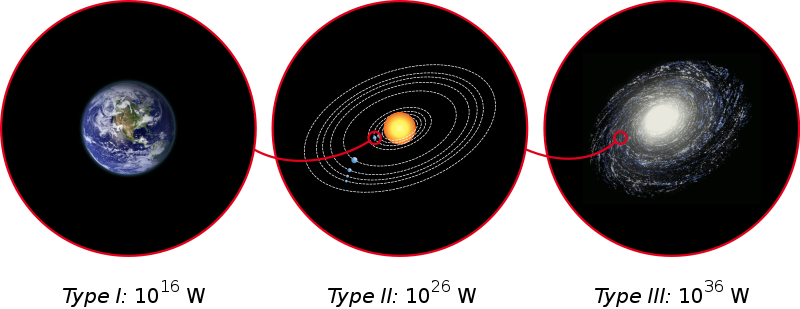

owned by [wikipedia.com](https://en.wikipedia.org/wiki/File:Consommations_%C3%A9nerg%C3%A9tiques_des_trois_types_de_l%27%C3%A9chelle_de_Kardashev.svg)

According to the Kardashev Scale, civilizations can be divides into three basic categories, based on the amount of energy they are able to use.

Type I civilizations (Planetary civilizations), are those who have utilized their whole planet energy. A planetary civilization could possibly be able to control its planet's natural phenomena.

Type II civilizations (Stellar civilizations), are capable to use their whole star energy. Stellar civilizations could have made constructions like a Dyson sphere, a hypothetical megastructure that completely encompasses a star and captures a large percentage of its solar power output.

Type III civilizations (Galactic civilizations), are those who have harnessed the energy of its entire Galaxy and possibly colonized it.

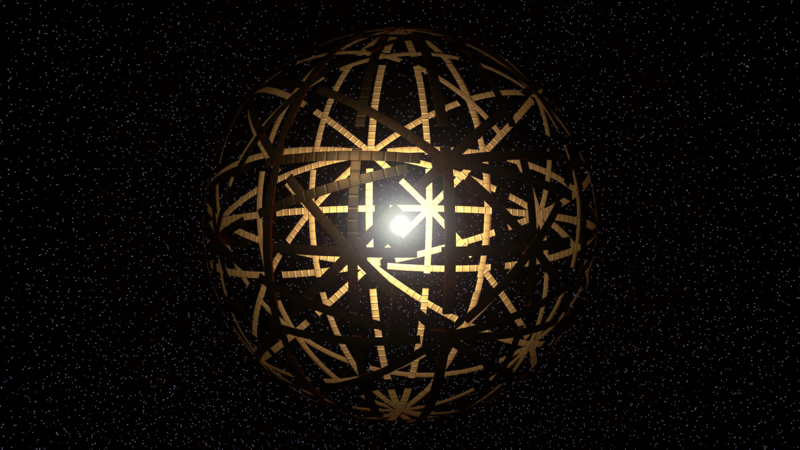
3D rendering of a Dyson sphere utilizing large, orbiting panels.
  owned by [wikipedia.com](https://en.wikipedia.org/wiki/File:A_Dyson_Swarm_Superstructure_(21983905140).png)

Sources [wiki](https://en.wikipedia.org/wiki/Kardashev_scale) , [astrobites](https://astrobites.org/2016/03/15/classifying-civilisations-an-introduction-to-the-kardashev-scale) , [wiki](https://en.wikipedia.org/wiki/Dyson_sphere)

### **Fermi paradox.**

The Fermi paradox is the conflict between the lack of clear, obvious evidence for extraterrestrial life and various high estimates for their existence. As a 2015 article put it, "If life is so easy, someone from somewhere must have come calling by now."

The great Italian-born physicist Enrico Fermi once asked some colleagues he was having lunch with the question: “Where are they?”, referring to the absence of any signs of extraterrestrial intelligences. This absence puzzled him, and his question later became known as Fermi’s paradox.

Maybe no civilization has managed to travel with speed greater than the speed of light. But even at speeds close to 10% of the speed of light a civilization could cross the entire Galaxy in the span of a million years. A number like that seems far too big, but it is actually just the 0.0077% of the age of the Galaxy. So there was plently of time for civilizations to colonize the entire Galaxy.

But why the universe is so silent?

Sources [wiki](https://en.wikipedia.org/wiki/Fermi_paradox) , [nickbostrom](https://www.nickbostrom.com/papers/fermi.pdf)

### **Zoo and Planetarium hypothesis.**

The zoo hypothesis is one of many theoretical explanations for the Fermi paradox and speculates on the assumed behavior and existence of technologically advanced extraterrestrial life and the reasons they refrain from contacting Earth.

According to zoo hypothesis, extraterrestrials have fenced humanity in, and observing, studying or protecting it, allowing Earth to be developed freely and have natural sociocultural development, similarly to people observing animals at a zoo.

If there is a vast number of extraterrestrial civilizations, however, this theory may break down under the uniformity of motive concept because every civilization should agree to not act and interact with humanity. It would take just a single extraterrestrial civilization to decide to act contrary to the imperative within human range of detection for it to be undone, and the probability of such a violation of hegemony increases with the number of civilizations.

The planetarium hypothesis, conceived in 2001 by Stephen Baxter, also attempts to provide a solution to the Fermi paradox by holding that our astronomical observations represent an illusion, created by a Type III civilization (Kardashev scale) capable of manipulating matter and energy on galactic scales. He postulates that we do not see evidence of extraterrestrial life because the universe has been engineered so that it appears empty of other life.

Both zoo and planetarium hypothesis are considered by researchers highly speculative and more aligned with theological theories.

Sources [wiki](https://en.wikipedia.org/wiki/Zoo_hypothesis) , [nickbostrom](https://www.nickbostrom.com/papers/fermi.pdf) , [wiki](https://en.wikipedia.org/wiki/Planetarium_hypothesis)

---

##  **_Cosmos Quotes_**

### **Quote 1.**

- Source [First quote](https://quotesgram.com/img/cosmos-quotes-inspirational/9506651/)

### **Quote 2.**

- Source [Second quote](https://quotesgram.com/img/quotes-about-the-cosmos/9322461/)

### **Quote 3.**

- Source [Third quote](https://quotesgram.com/img/quotes-about-the-cosmos/12369649/)

### **Quote 4.**

- Source [Fourth quote](https://quotesgram.com/img/quotes-about-the-cosmos/6282733/)

### **Quote 5.**

- Source [Fifth quote](https://quotesgram.com/img/quotes-about-the-cosmos/2598228/)

---

##  **Zodiac**

The zodiac is a belt-shaped region of the sky that extends approximately 8° north or south (as measured in celestial latitude) of the ecliptic, the apparent path of the Sun across the celestial sphere over the course of the year. The paths of the Moon and visible planets are within the belt of the zodiac.

In Western astrology, and formerly astronomy, the zodiac is divided into twelve signs, each occupying 30° of celestial longitude and roughly corresponding to the star constellations: Aries, Taurus, Gemini, Cancer, Leo, Virgo, Libra, Scorpio, Sagittarius, Capricorn, Aquarius, and Pisces.

These astrological signs form a celestial coordinate system, or more specifically an ecliptic coordinate system, which takes the ecliptic as the origin of latitude and the Sun's position at vernal equinox as the origin of longitude.

 

Source [Wiki](https://en.wikipedia.org/wiki/Zodiac)

---

##  **Frequent questions**

###  **1. Questions about Stars**

- How many stars are there in the universe? [Answer / Source](https://www.space.com/26078-how-many-stars-are-there.html)
- How many stars can we see at night? [Answer / Source](https://www.thoughtco.com/how-many-stars-can-you-see-3071116#:~:text=On%20average%2C%20however%2C%20the%20most%20anyone%20can%20really,country%20areas%20away%20from%20lights%20can%20see%20more.)
- What is the biggest star in the Universe? [Answer/ Source](https://ourplnt.com/biggest-stars-universe/)

###  **2. Do We Live in a Multiple Universe?** [Answser / Source](https://astronomy.com/magazine/greatest-mysteries/2019/07/37-do-we-live-in-a-multiple-universe)

###  **3. Questions about Planets**
- How many planets are there in our solar system? [Answer/ Source](https://space-facts.com/faq/)
- What is the smallest planet? [Answer/ Source](https://space-facts.com/faq/)
- What is the largest planet? [Answer/ Source](https://space-facts.com/faq/)
- Which planet is closest to the Sun? [Answer/ Source](https://space-facts.com/faq/)
- Which planet is farthest from the Sun? [Answer/ Source](https://space-facts.com/faq/)
- What is the coldest planet? [Answer/ Source](https://space-facts.com/faq/)
- What is the hottest planet? [Answer/ Source](https://space-facts.com/faq/)
- What are the inner planets? [Answer/ Source](https://space-facts.com/faq/)
- What are the outer planets? [Answer/ Source](https://space-facts.com/faq/)
- Which planets have rings? [Answer/ Source](https://space-facts.com/faq/)
- Is there life on other planets? [Answer/ Source](https://space-facts.com/faq/)

---

##  **_Memes_**

Even though Astronomy is such a difficult topic it can also be used for fun and entertainment. You just need to find a way to present it more approachable. Website "Starlust" use astronomy as an inspiration for memes to make peoples life more colorfull.
These are some excamples of what they offer to their users.

### **Meme 1.**

 

### **Meme 2.**

 

### **Meme 3.**

 

### **Meme 4.**

 

### **Meme 5.**

 

### **Meme 6.**

 

source [starlust](https://starlust.org/space-memes/)

---
## **Cosmos Books**
Source [Best space and astronomy books](https://www.space.com/32982-best-astronomy-books.html)

### **A Brief History of Time**

 Author: Stephen Hawking, 
Publisher: Bantam (1988)
 

### **The Human Cosmos: A Secret History of the Stars**

 Author: Jo Marchant, 
Publisher: Canongate Books (2020)
 

### **Constellations: The Story of Space Told Through the 88 Known Star Patterns in the Night Sky)**

 Author: Govert Schilling, 
Cartographer: Wil Tirion, 
Publisher: Black Dog & Leventhal (2019)
 

### **Cosmos**

 Author: Carl Sagan, 
Publisher: Random House (1980)
 

### **Missions To Mars**

 Author: Larry S. Crumpler, 
Publisher: Harper Design (2021)
 

---

##  **Cosmos Movies**

### **The Midnight Sky (2020)**

In the aftermath of a global catastrophe, a lone scientist in the Arctic races to contact a crew of astronauts with a warning not to return to Earth.

### **Gravity (2013)**

On an outer space mission, Dr Ryan Stone, an engineer, and Matt Kowalski, an astronaut, are hit by high-speed space debris. As the situation gets dire, Stone, the lone survivor, rises to the occasion.

### **Interstellar (2014)**

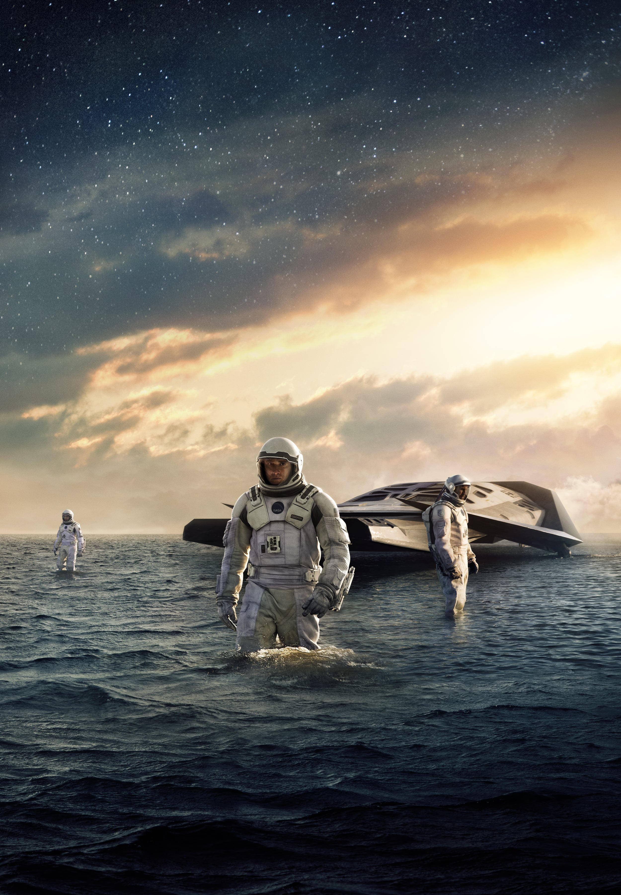
A team of explorers travel through a wormhole in space in an attempt to ensure humanity's survival.

### **Europa Report (2013)**

An international crew of astronauts undertakes a privately funded mission to search for life on Jupiter's fourth largest moon.

### **Apollo 13 (1995)**

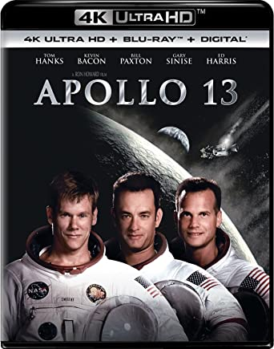
he film depicts astronauts Lovell, Jack Swigert, and Fred Haise aboard Apollo 13 for America's fifth crewed mission to the Moon, which was intended to be the third to land. En route, an on-board explosion deprives their spacecraft of much of its oxygen supply and electrical power, which forces NASA's flight controllers to abort the Moon landing and turns the mission into one of seeking scientific and mechanical solutions to get the three men home safely.

---

##  **Cosmos Series**

**Description**

Cosmos is a collection of three science documentary television series presented first by Carl Dagan and then by Neil deGrasse Tyson.

### \*Cosmos: A Personal Voyage (1980)\*\*

owned by [wikipedia.com](https://en.wikipedia.org/wiki/File:CosmosTC.jpg)

Astronomer Carl Sagan leads us on an engaging guided tour of the various elements and cosmological theories of the universe.

Creators: Ann Druyan, Carl Sagan, Steven Soter

Stars: Carl Sagan, Jaromír Hanzlík, Jonathan Fahn

IMDb Rating: 9.3

source [imdb](https://www.imdb.com/title/tt0081846/)

### \*Cosmos: A Spacetime Odyssey (2014)\*\*

owned by [wikipedia.com](https://en.wikipedia.org/wiki/File:Cosmos_spacetime_odyssey_titlecard.jpg)

An exploration of our discovery of the laws of nature and coordinates in space and time.

Creators: Ann Druyan, Steven Soter

Stars: Neil deGrasse, TysonChristopher, EmersonKeythe Farley

IMDb Rating: 9.3

source [imdb](https://www.imdb.com/title/tt2395695/)

### \*Cosmos: Possible Worlds (2020)\*\*

owned by [wikipedia.com](https://en.wikipedia.org/wiki/File:Cosmos_Possible_Worlds_title_card.jpg)

Following the wildly successful "Cosmos: A Spacetime Odyssey," Neil deGrasse Tyson returns as host to translate more revelations of science into a lavish transporting experience, taking audiences on a series of spiritual voyages of exploration. The show reveals previously uncharted realms, including lost worlds, worlds yet to come, and the worlds that humans may one day inhabit. Ann Druyan, original creative collaborator to Carl Sagan, whose iconic docuseries "Cosmos" provided inspiration for this series, serves as executive producer alongside Seth MacFarlane.

Creators: Ann Druyan, Brannon Braga

Stars: Neil deGrasse, Seth MacFarlane, Sasha Sagan

IMDb Rating: 9.1

source [imdb](https://www.imdb.com/title/tt11170862/)

---

##  **_Admired Personalities_**

### **Mahatma Gandhi**

Mohandas Karamchand Gandhi (2 October 1869 – 30 January 1948), also known as Gandhi, was an Indian lawyer, anti-colonial nationalist and political ethicist who employed nonviolent resistance to lead the successful campaign for India's independence from British rule, and to later inspire movements for civil rights and freedom across the world. The honorific Mahātmā, first applied to him in 1914 in South Africa, is now used throughout the world. As such, he came to be considered the father of his country. Gandhi is internationally esteemed for his doctrine of nonviolent protest (satyagraha) to achieve political and social progress.

source [britannica](https://www.britannica.com/biography/Mahatma-Gandhi)

---

### **Margaret Hamilton**

Margaret Heafield Hamilton (born August 17, 1936) is an American computer scientist, systems engineer, and business owner. She was director of the Software Engineering Division of the MIT Instrumentation Laboratory, which developed on-board flight software for NASA's Apollo program. She later founded two software companies—Higher Order Software in 1976 and Hamilton Technologies in 1986, both in Cambridge, Massachusetts. 

Hamilton has published more than 130 papers, proceedings, and reports, about sixty projects, and six major programs. She is one of the people credited with coining the term "software engineering".

On November 22, 2016, Hamilton received the Presidential Medal of Freedom from president Barack Obama for her work leading to the development of on-board flight software for NASA's Apollo Moon missions. 

source [wikipedia](https://en.wikipedia.org/wiki/Margaret_Hamilton_(software_engineer))

---

### **Nelson Mandela**

Nelson Rolihlahla Mandela (18 July 1918 – 5 December 2013) was a South African anti-apartheid revolutionary and political leader who served as the first president of South Africa from 1994 to 1999. He was the country's first black head of state and the first elected in a fully representative democratic election. His government focused on dismantling the legacy of apartheid by tackling institutionalised racism and fostering racial reconciliation. Ideologically an African nationalist and socialist, he served as the president of the African National Congress (ANC) party from 1991 to 1997. 

source [wikipedia](https://en.wikipedia.org/wiki/Nelson_Mandela)

---

### **Martin Luther King**

Martin Luther King Jr. (born Michael King Jr.; January 15, 1929 – April 4, 1968) was an American Baptist minister and activist who became the most visible spokesman and leader in the civil rights movement from 1955 until his assassination in 1968. An African American church leader and the son of early civil rights activist and minister Martin Luther King Sr., King advanced civil rights for people of color in the United States through nonviolence and civil disobedience, inspired by his Christian beliefs and the nonviolent activism of Mahatma Gandhi. His role in leading the cause of civil rights in the South differed in style from the previous accommodationist stances represented by Booker T. Washington and black-and-tan faction leader Perry Wilbon Howard II. 

source [wikipedia](https://en.wikipedia.org/wiki/Martin_Luther_King_Jr.)

---

### **Albert Einstein**

Albert Einstein (14 March 1879 – 18 April 1955) was a German-born theoretical physicist, widely acknowledged to be one of the greatest physicists of all time. Einstein is best known for developing the theory of relativity, but he also made important contributions to the development of the theory of quantum mechanics. Relativity and quantum mechanics are together the two pillars of modern physics. His mass–energy equivalence formula E = mc2, which arises from relativity theory, has been dubbed "the world's most famous equation".

source [wikipedia](https://en.wikipedia.org/wiki/Albert_Einstein)

---

### **Stephen Hawking**

Stephen William Hawking CH CBE FRS FRSA (8 January 1942 – 14 March 2018) was an English theoretical physicist, cosmologist, and author who, at the time of his death, was director of research at the Centre for Theoretical Cosmology at the University of Cambridge.Between 1979 and 2009, he was the Lucasian Professor of Mathematics at the University of Cambridge.Hawking was born in Oxford, into a family of physicians. In October 1959, at the age of 17, he began his university education at University College, Oxford, where he received a first-class BA degree in physics. In October 1962, he began his graduate work at Trinity Hall, Cambridge, where in March 1966, he obtained his PhD degree in applied mathematics and theoretical physics, specialising in general relativity and cosmology. In 1963, Hawking was diagnosed with an early-onset slow-progressing form of motor neurone disease (amyotrophic lateral sclerosis – ALS, for short) that gradually, over the decades, paralysed him.After the loss of his speech, he communicated through a speech-generating device initially through use of a handheld switch, and eventually by using a single cheek muscle.

source [wikipedia](https://en.wikipedia.org/wiki/Stephen_Hawking)

---

### **Neil Armstrong**

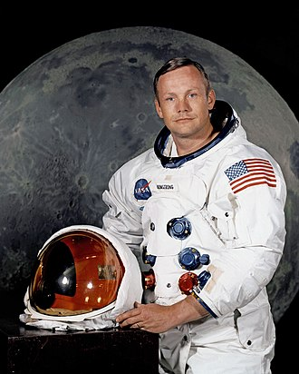

Neil Alden Armstrong (August 5, 1930 – August 25, 2012) was an American astronaut, aeronautical engineer, and the first person to walk on the Moon. He was also a naval aviator, test pilot, and university professor.Armstrong was born and raised in Wapakoneta, Ohio. A graduate of Purdue University, he studied aeronautical engineering his college tuition was paid for by the U.S. Navy under the Holloway Plan. He became a midshipman in 1949 and a naval aviator the following year. He saw action in the Korean War, flying the Grumman F9F Panther from the aircraft carrier USS Essex. In September 1951, while making a low bombing run, Armstrong's aircraft was damaged when it collided with an anti-aircraft cable, strung across a valley, which cut off a large portion of one wing. Armstrong was forced to bail out. After the war, he completed his bachelor's degree at Purdue and became a test pilot at the National Advisory Committee for Aeronautics (NACA) High-Speed Flight Station at Edwards Air Force Base in California. He was the project pilot on Century Series fighters and flew the North American X-15 seven times. He was also a participant in the U.S. Air Force's Man in Space Soonest and X-20 Dyna-Soar human spaceflight programs.

source [wikipedia](https://en.wikipedia.org/wiki/Neil_Armstrong)

---

### **Alan Turing**

Alan Mathison Turing (23 June 1912 – 7 June 1954) was an English mathematician, computer scientist, logician, cryptanalyst, philosopher, and theoretical biologist. Turing was highly influential in the development of theoretical computer science, providing a formalisation of the concepts of algorithm and computation with the Turing machine, which can be considered a model of a general-purpose computer. Turing is widely considered to be the father of theoretical computer science and artificial intelligence. 

source [wikipedia](https://en.wikipedia.org/wiki/Alan_Turing)

---

##  **Youtube Videos**
  ### **Earth 101 | National Geographic**
  

Source [National Geographic](https://www.youtube.com/channel/UCpVm7bg6pXKo1Pr6k5kxG9A)

---

 ### **Mars 101 | National Geographic**
  

Source [National Geographic](https://www.youtube.com/channel/UCpVm7bg6pXKo1Pr6k5kxG9A)

---

 ### **Universe Size Comparison**
  

Source [Kurzgesagt's Universe App](https://shop-eu.kurzgesagt.org/products/universe-in-a-nutshell-app?userselect=1)

---